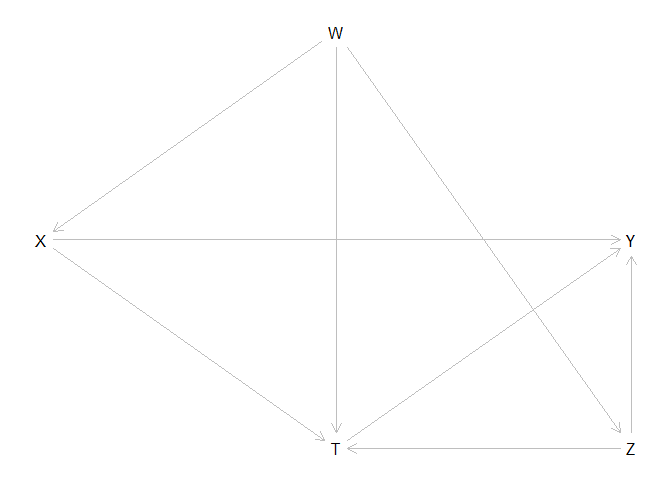
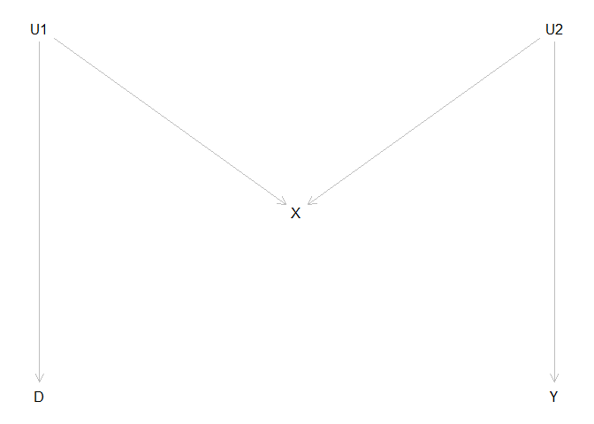
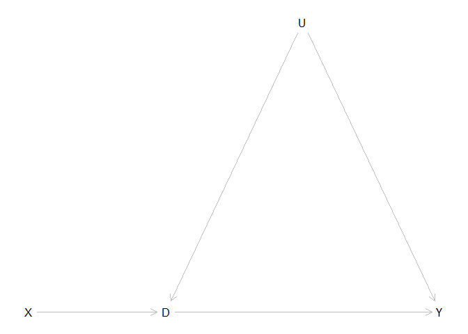

Tutorial-1: More controls, the merrier? Two examples of selecting control variables
================
Xi Chen
2024-06-07

# **A Short Tutorial on DAGitty**

## Description

This is a short tutorial of DAGitty. We will focus on the basics of
drawing DAGs and performing graphical analyses on DAGs. DAGitty covers
more useful functioning than what is introduced here. For more details,
please visit <http://www.dagitty.net>.

``` r
# please download and load dagitty to the workspace. 
require(dagitty)
```

    ## Loading required package: dagitty

    ## Warning: package 'dagitty' was built under R version 4.2.3

## The Basics

You may draw a DAG with a simple symbolic language used by DAGitty. To
draw a DAG, you may use statement like: ‘dag{…}’, and within the curly
brackets, you need to specify nodes (variables) and links. For nodes,
use a statement like ‘X\[…\]’, and within the brackets, you specify
properties such as positions (‘pos = …’). For links, you specify the
links between nodes, such as ‘X -\> Y’. Note that you may also specify
the paths to make things easier.

``` r
# Note that you may also use different paths statements for the same DAG, as long as all links are included. 
g <- dagitty('dag {
    X [pos="0,1"]
    T [pos="1,2"]
    Z [pos="2,2"]
    W [pos="1,0"]
    Y [pos="2,1"]
    
    X -> T <- Z -> Y
    X <- W -> T -> Y
    W -> Z
    X-> Y
}')
plot(g)
```



Given the DAG, you may request a bunch of things, such as parents,
children, ancestors and descendants of nodes.

``` r
#By convention, descendants(g,v) and ancestors(g,v) include v but children(g,v) and parents(g,v) do not.
parents(g,"Z") # parents of Z
```

    ## [1] "W"

``` r
ancestors(g,"Z") # ancestors of Z
```

    ## [1] "Z" "W"

``` r
children(g,"W") #children of W
```

    ## [1] "T" "X" "Z"

``` r
descendants(g,"W") #descendants of W
```

    ## [1] "W" "Z" "Y" "X" "T"

## Path Analysis

Furthermore, you can analyze the paths between any pair of nodes using
*paths()*. The function returns a list with the first element showing
all paths and the second whether paths are open (i.e., d-separated).

``` r
#all paths between X and Y 
paths(g,"X","Y") 
```

    ## $paths
    ## [1] "X -> T -> Y"           "X -> T <- W -> Z -> Y" "X -> T <- Z -> Y"     
    ## [4] "X -> Y"                "X <- W -> T -> Y"      "X <- W -> T <- Z -> Y"
    ## [7] "X <- W -> Z -> T -> Y" "X <- W -> Z -> Y"     
    ## 
    ## $open
    ## [1]  TRUE FALSE FALSE  TRUE  TRUE FALSE  TRUE  TRUE

You can also test if conditioning on some variables d-separates a pair
of nodes by using *dseparated*.

``` r
nodes <- c("W","Y")
if(dseparated(g,"X","Z",nodes)){
  message("X"," and ", "Y"," are independent.")
} else {
  message("X"," and ", "Y", " are not independent.")
}
```

    ## X and Y are not independent.

As a matter of fact, you may also get all implied independencies in the
graph with the function below:

``` r
impliedConditionalIndependencies(g)
```

    ## W _||_ Y | T, X, Z
    ## X _||_ Z | W

## Adjustment Sets

Given a DAG, the package also gives suggestions of the set of variables
for adjustments for the identification of a causal effect. This function
makes use of the do-calculus.

``` r
#To get all sets of variables for backdoor adjustments
print("All adjustment sets")
```

    ## [1] "All adjustment sets"

``` r
adjustmentSets(g,"X","Y",type = "all")
```

    ## { W }
    ## { W, Z }

``` r
#The minimal set if "type" is not specified
print("The minimal adjustment set")
```

    ## [1] "The minimal adjustment set"

``` r
adjustmentSets(g,"X","Y")
```

    ## { W }

You may also test if including a node in the adjustment set is valid.

``` r
#set the cause and outcome variable
exposures(g) <- "X"
outcomes(g) <- "Y"

#checking if including T is Okay
isAdjustmentSet(g,"T")
```

    ## [1] FALSE

# Studying Two Special DAGs

When we use the conditioning strategy, it is crucial to select the right
set of X that ensure the conditional independence. Rosenbaum (2002)
wrote that “there is no reason to avoid adjustment for a variable
describing subjects before treatment.” Similarly, Rubin (2007) wrote
that “typically, the more conditional an assumption, the more acceptable
it is.” Both argued that we should **control for all observed
pretreatment covariate**. VanderWeele and Shpitser (2011) called it the
pretreatment criterion.

Judea Pearl (the inventor of DAG) disagreed with this recommendation and
gave two counterexamples below. He got the counterexamples by studying
DAGs. These examples alert us that not all variables are candidates for
good controls. And they deepen our understanding of control variables
and causality.

## M-Bias

M-bias appears in the following causal diagram with an M-structure. In
the DAG, U1 and U2 are assumed to be unobserved and D, X, and Y are
observed.

``` r
g <- dagitty('dag {
    D [pos="0,2"]
    U1 [pos="0,0"]
    U2 [pos="2,0"]
    X [pos="1,1"]
    Y [pos="2,2"]
    
    D <- U1 -> X
    X <- U2 -> Y
}')

plot(g)
```



Based on the DAG, assume the following linear model system between these
variables: 

$$ 
\begin{cases}
X & =U_{1}+U_{2}+\epsilon_{X}\\
D & =U_{1}+\epsilon_{d}\\
Y & =U_{2}+\epsilon_{y}
\end{cases}
$$

Assume all the variables and the random variables follow a standard
normal distribution. We can then simulate the data like the following:

``` r
# suppose we use 1e+6 observations
n <- 1e+6

# setting seed for replication 
set.seed(123)

# simulate U1 and U2
U1 <- rnorm(n)
U2 <- rnorm(n)

# simulate X, D, and Y
X <- U1 + U2 + rnorm(n)
D <- U1 + rnorm(n)
Y <- U2 + rnorm(n)
```

Now, we are comparing the estimation of the effect of `D on Y` with
vs. without `X` as a control variable.

``` r
beta_without_X <- round(summary(lm(Y ~ 0 + D))$coef[1, 1], 4)
beta_with_X <- round(summary(lm(Y ~ 0 + D + X))$coef[1, 1], 4)

result <- c(beta_without_X, beta_with_X, 0)
names(result) <- c("Without_X", "With_X", "True_Effect")
result
```

    ##   Without_X      With_X True_Effect 
    ##      0.0001     -0.1996      0.0000

We can see that when we do not control for X the regression gives us the
true effect. However, the controlling of X leads to a big bias. This is
because the rule of d-separation, D and Y are already d-separated on the
DAG. Conditioning on X, on the other hand, makes D and Y not separated
anymore. Intuitively, X contains information of both D and Y, as X
shares a parent with D or Y.

## Z-Bias (instrumental bias)

Z-bias appears in the following causal diagram. In the DAG, U is assumed
to be unobserved and D, X, and Y are observed.

``` r
g <- dagitty('dag {
    D [pos="2,0"]
    U [pos="3,-1"]
    X [pos="1,0"]
    Y [pos="4,0"]
    
    X -> D -> Y
    D <- U -> Y
}')

plot(g)
```



Based on the DAG, assume the following linear model system between these
variables: 

$$ 
\begin{cases}
D & =X+U+\epsilon_{d}\\
Y & =D+U+\epsilon_{y}
\end{cases}
$$

Assume all the variables and the random variables follow a standard
normal distribution. We can then simulate the data like the following:

``` r
# simulate data 
X = rnorm(n)
U = rnorm(n)
D = X + U + rnorm(n)
Y = D + U + rnorm(n)
```

Now, we are comparing the estimation of the effect of `D on Y` with
vs. without `X` as a control variable.

``` r
beta_without_X <- round(summary(lm(Y ~ 0 + D))$coef[1, 1], 4)
beta_with_X <- round(summary(lm(Y ~ 0 + D + X))$coef[1, 1], 4)

result <- c(beta_without_X, beta_with_X, 1)
names(result) <- c("Without_X", "With_X", "True_Effect")
result
```

    ##   Without_X      With_X True_Effect 
    ##      1.3333      1.5000      1.0000

We can see that when we do not control for X the regression has a bias
of 0.33. However, the controlling of X leads to a bigger bias of 0.50.
Here is the intuition. The treatment D is a function of X and U. If we
condition on X, it is merely a function of U. Therefore, conditioning
makes D “less random,” and more critically, makes the unmeasured
confounder U play a more important role in D on Y. Consequently, the
confounding bias due to U is amplified by conditioning on X. This
idealized example illustrates the danger of over adjusting for some
covariates.
