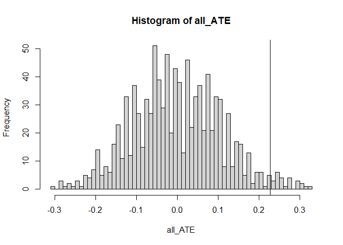

Tutorial 2: Fisher and Neyman’s Approach to CRE
================
Xi Chen
2023-06-10

Pleas download “T2_Data.Rdata” for this tutorial.

The data for this section `label` describe a field experiment, conducted
by a marketing research company for Duvel - a Belgian beer brand. The
study focuses on how the label of Duvel on the beer bottles influences
consumers’ preferences of the beer. The company recruits 320 consumers
in the study, and randomly assigns 160 (half) consumers to the treatment
group.

Consumers in the treatment group have beers in labeled bottles, and
those in the control have beers without a label. Then, all consumers
fill out a 7-point scale about the preferences of the beer (with
multiple items on the taste, color, etc.). Data “label” record the study
results. In the data, the variable “D” is a dummy with value 1 if a
consumer is in the treatment group, and 0 if in the control. The
variable “Y” records consumers’ final preferences.

``` r
# Load and scan the data.  
load("T2_Data.Rdata")
head(label)
```

    ##   D   Y
    ## 1 1 6.0
    ## 2 0 6.5
    ## 3 0 7.5
    ## 4 1 8.5
    ## 5 1 7.0
    ## 6 1 8.0

We will estimate the average treatment effect (ATE) for this experiment
as the difference in the average values of Y when $D==1$ versus when
$D==0$. The following code 1) calculates the average values of $Y$ for
the two values of $D$, and 2) calculates their difference (subtracting
the first value of $Y$ for $D==0$ from the second value of $Y$ for
$D==1$). These steps produce a single number representing the estimated
average treatment effect.

``` r
ATE <- mean(label$Y[label$D==1])-
  mean(label$Y[label$D==0])
print(paste("The ATE:",as.character(ATE),sep = " "))
```

    ## [1] "The ATE: 0.228125"

## Fisher’s Exaxt P-value

Should we trust that the estimate of 0.228 reflects a real difference in
preferences, or could that estimate differ from zero simply because of
the variation in the treatment assignment? We will use randomization
inference to address this question.

Different from the example in class where we have only 6 units, this
study has 320 consumers, split into two groups. The possible no. of
assignments is $C_{320}^{160}$. It’s a huge number.

``` r
choose(320,160) 
```

    ## [1] 9.519725e+94

The idea behind Fisherian test is this:

We start with a sharp null hypothesis $H_{0}$, and assume it’s correct.
For this study, we assume $H_{0}:Y_{i}^{1}-Y_{i}^{0}=0$ That is, no
individual treatment effect for all consumers. Or equivalently,
$Y_{i}^{1}=Y_{i}^{0}$, which enables us to obtain the potential outcomes
for all consumers with $Y=Y^{1}=Y^{0}$.

Under $H_{0}$, the fact that the estimate of the ATE (0.228) differs
from 0 is simply a result of the way consumers were assigned to the
treatment and control groups. This begs the question of how “typical”
our estimate is. Is it simply due to chance?

### The Procedure

First consider a single, hypothetical assignment of consumers to
treatment and control. Note that is study adopts a completely randomized
experiment design. As such, we can “simulate” an what-if assignment by
using a random draw. This assignment differs from the one in the actual
experiment, but it is equally likely to have happened.

``` r
set.seed(123) # for replication

new_D <- rep(0,320) # a vector of new assignment
new_D[sample(1:320,160,replace = F)] <- 1 # selecting a subset and assigning the treatment

head(new_D)
```

    ## [1] 1 0 0 1 1 0

``` r
sum(new_D==1) # double checking
```

    ## [1] 160

Given the sharp null hypothesis, we now create two vectors of potential
outcomes: $Y^{1}$ and $Y^{0}$, with both equal to the observed outcome
in data.

``` r
Y0 <- label$Y
Y1 <- label$Y
```

Next, we obtain the ATE under the hypothetical assignment new_D.

``` r
new_ATE <- mean(Y1[new_D==1])-mean(Y0[new_D==0])
print(paste("The Hypothetical ATE:",as.character(new_ATE),sep = " "))
```

    ## [1] "The Hypothetical ATE: 0.0531249999999996"

### Getting all ATEs

Having done one draw of assignments, we can now repeat it for many times
to approximate the Fisher test. Here I will use 1,000 repetitions, and
you may try more repetitions.

``` r
#You may also put the above code into a function and rerun the function for many times. I use for-loops here, just to make things easier to understand. 

ns <- 1000 #change here for different repetitions
all_ATE <- rep(0,ns) # a vector to store results

for (i in 1:ns) {
  new_D <- rep(0,320) # a vector of new assignment
  new_D[sample(1:320,160,replace = F)] <- 1 # assigning the treatment
  new_ATE <- mean(Y1[new_D==1])-mean(Y0[new_D==0]) # calculating ATE
  all_ATE[i] <- new_ATE
}
```

Getting a histogram to visualize the ATEs and the vertical line is the
observed ATE.

``` r
hist(all_ATE,50)
abline(v=ATE)
```

<!-- -->

Next, we obtain the p-values by checking the percentage of ATEs that are
larger than the observed one.

``` r
fisher_p <- mean(all_ATE>ATE)
print(paste("Fisher's exact p-value is:",as.character(fisher_p),sep = " "))
```

    ## [1] "Fisher's exact p-value is: 0.025"

## Neyman’s Repeated Sampling Approach

Recall that Neyman’s approach with Neyman variance becomes a two-sample
t-test (with unequal variance), if we use the sample variance as
estimators of the variance of treatment vs. control potential outcomes,
as in the equations below.


$$
\begin{cases}
    \hat{S}_{c}^{2}=\frac{1}{N_c-1}\sum_{i\in N_c}{\left( Y_{i}^{c}-\overline{Y^c} \right) ^2}\\
    \hat{S}_{t}^{2}=\frac{1}{N_t-1}\sum_{j\in N_t}{\left( Y_{j}^{t}-\overline{Y^t} \right) ^2}\\
\end{cases}
$$


Given the null hypothesis of zero treatment effect, the Neyman’s test
becomes a two-sample t-test of equal means. Note that this is a
two-sided test and the variance of two groups is unequal.

``` r
t.test(Y~D,label,alternative="two.sided",var.equal=F)
```

    ## 
    ##  Welch Two Sample t-test
    ## 
    ## data:  Y by D
    ## t = -2.1678, df = 318, p-value = 0.03092
    ## alternative hypothesis: true difference in means between group 0 and group 1 is not equal to 0
    ## 95 percent confidence interval:
    ##  -0.43517093 -0.02107907
    ## sample estimates:
    ## mean in group 0 mean in group 1 
    ##        6.834375        7.062500
