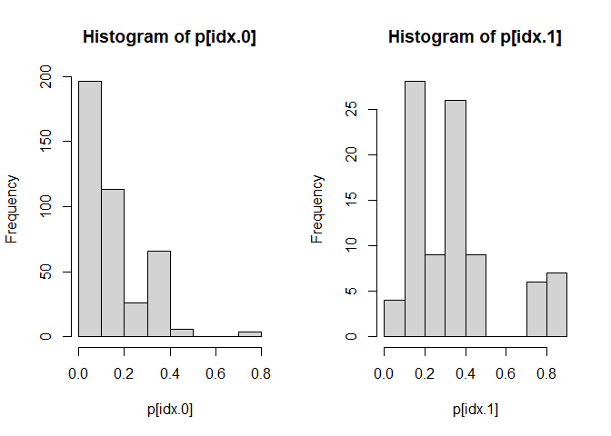

Tutorial-2: Matching and Weighting Estimator
================
Xi Chen
2023-06-10

Pleas download `T2_Data.Rdata` for this tutorial.

The data for this tutorial `AR` describe a field experiment, conducted
by an online retailer of glasses. The study focuses on the effect of
augmented reality (AR) as a virtual try-on tool for online purchases of
glasses. The company tracked 20,000 customers who purchased once in 6
months time. Specifically, they recorded 1) whether a customer used the
AR tool (coded as a dummy) and 2) the size of the order (in monetary
value; transformed for privacy reasons).

Aside from the cause variable - `used_AR` and the outcome variable
`order_size`, the company also recorded a rich set of consumer features.
For privacy reasons, here 3 most important synthetic variables are
shared. These variables are synthesized from the consumer features.
Specifically, these 3 variables captures the purchase behaviors of
consumers: the recency, frequency and average monetary values of
consumers’ historical purchases. Each variable is categorized into two
levels. For example, for “recency”, if consumers make a purchase more
recently, they are tagged with “Recent” and otherwise, with “Overdue”.

Consumers in the treatment group used AR in their orders, and those in
the control not. You are given a sample (500 consumers) of the full
data, and asked to quantify the effectiveness of ARs.

``` r
# Load and scan the data.  
load("T2_Data.Rdata")
head(AR)
```

    ##       consumer_id recency frequency  monetary used_AR order_size
    ## 15329       15329 Overdue  Frequent Low value       0          0
    ## 11263       11263  Recent  Frequent Low value       0          2
    ## 6049        06049  Recent Infreqent Low value       0          0
    ## 15866       15866  Recent Infreqent Low value       0          0
    ## 9007        09007  Recent Infreqent Low value       0          0
    ## 3518        03518  Recent  Frequent Low value       0          0

# Matching

Note: the following analysis is more of a show-and-tell. In practice,
you can make the code much more efficient. Or you may use other matching
methods in read-made packages such as `Matching` or `MatchIt`. Here, we
will follow the procedure discussed in class step by step. Also, for
statistical inference, you may use a subsampling procedure, which will
be omitted here.

## Step 1 - Define and calculate the “closeness” of consumers

In the data, all three variables of $X_i$ are discrete (binary).
Therefore, we use a standard measure called “Jaccard distance” to
measure the differences (type `?dist` in the command line). Notice that
the smaller the measure, the more similar two consumers.

``` r
distance <- dist(data.matrix(AR[,2:4])-1, # coerce into a binary matrix
                 method = "binary") # choose binary or the Jaccard measure
# coerce the distance matrix into a normal matrix for later use

distance <- as.matrix(distance)
distance[1:10,1:10] # just to check the first 10 rows and columns
```

    ##       15329 11263 6049 15866 9007 3518 12466 1430 14784 9967
    ## 15329   0.0   0.5    1     1    1  0.5   0.0  0.5   0.0  0.0
    ## 11263   0.5   0.0    1     1    1  0.0   0.5  1.0   0.5  0.5
    ## 6049    1.0   1.0    0     0    0  1.0   1.0  1.0   1.0  1.0
    ## 15866   1.0   1.0    0     0    0  1.0   1.0  1.0   1.0  1.0
    ## 9007    1.0   1.0    0     0    0  1.0   1.0  1.0   1.0  1.0
    ## 3518    0.5   0.0    1     1    1  0.0   0.5  1.0   0.5  0.5
    ## 12466   0.0   0.5    1     1    1  0.5   0.0  0.5   0.0  0.0
    ## 1430    0.5   1.0    1     1    1  1.0   0.5  0.0   0.5  0.5
    ## 14784   0.0   0.5    1     1    1  0.5   0.0  0.5   0.0  0.0
    ## 9967    0.0   0.5    1     1    1  0.5   0.0  0.5   0.0  0.0

## Step 2 - find the “closest” consumers

Given the distance matrix, we next find the closest consumers for each
consumer in the data. Here, we use sampling with replacement, meaning a
consumer may be matched multiple times to other consumers. This is
generally preferred for smaller data.

``` r
# initialize some dimensions
N <- dim(AR)[1]
N.1 <- sum(AR$used_AR)

# the index of treated and control units
idx.1 <- which(AR$used_AR==1)
idx.0 <- which(AR$used_AR==0)

# we create an empty list to store results
best_matches <- vector(mode = "list", N)

for (i in 1:N) { # separate the treated and the control
  if (AR$used_AR[i]==1) { # for the treated
    dist_i <- distance[i,idx.0] # get the distances to all the controls
    best_i <- idx.0[which(dist_i==min(dist_i))] # select controls with smallest distance
  } else if (AR$used_AR[i]==0) { # for the control 
    dist_i <- distance[i,idx.1] # get the distances to all the treated
    best_i <- idx.1[which(dist_i==min(dist_i))] # select treated with smallest distance
  }
  best_matches[[i]] <- best_i # store results
}
```

## Step 3 - Get the treatment effects

Given the matched samples for each consumer, we first us the average of
the matched samples to obtain the potential outcomes.

``` r
# define a function to obtain the potential outcome
get_potential_outcomes <- function (x) {
  return(mean(AR$order_size[x]))
}

# apply the function to the list
potential_purchase <- sapply(best_matches,get_potential_outcomes,simplify = T)
```

Next, we can calculate the ATT (average treatment effects on the
treated) and the ATC (average treatment effects on the control)

``` r
ATT_matching <- mean(AR$order_size[idx.1])-
  mean(potential_purchase[idx.1])

ATC_matching <- -mean(AR$order_size[idx.0])+
  mean(potential_purchase[idx.0])

#ATE is the weighted average of ATT and ATC
ATE_matching <- N.1/N*ATT_matching +
  (1-N.1/N)*ATC_matching

# print out the results
print(list(ATE = ATE_matching,
           ATT = ATT_matching,
           ATC = ATC_matching))
```

    ## $ATE
    ## [1] 10.10295
    ## 
    ## $ATT
    ## [1] 14.9714
    ## 
    ## $ATC
    ## [1] 9.048706

# Weighting

As in the tutorial on classical matching, all the selection (of
treatment assignment) is on three variables: recency, frequency, and
monetary. Given the data, there are two main parts to estimating
treatment effects using the weighting approach. The first part involves
obtaining estimates of customers’ propensities to use the AR. For this
tutorial, we will use logistic regression to obtain these propensity
scores. The second part involves using weights that are based on the
propensity scores to estimate the treatment effects.

## Step 1: Estimating the propensity to use the AR

There are three variables that we can use to estimate the propensity to
use the AR: `recency`, `frequency`, and `monetary`. These variables
collectively satisfy the back-door criterion. That is, we can condition
on these variables to block all back-door paths between `used_AR` and
`total_order`.

To estimate the propensity scores, we set up a logistic regression.
Because our objective is to estimate customers’ propensities to use the
AR, we make `used_AR` the dependent variable in the regression. For the
model spec, we will account for all only the main effects. You may try
alternative specs such as with all 2- and 3-way interactions.

``` r
propensity_fit <- 
    glm(used_AR ~ recency + frequency + monetary, data = AR,
        family = binomial)
summary(propensity_fit)
```

    ## 
    ## Call:
    ## glm(formula = used_AR ~ recency + frequency + monetary, family = binomial, 
    ##     data = AR)
    ## 
    ## Deviance Residuals: 
    ##     Min       1Q   Median       3Q      Max  
    ## -1.7623  -0.6016  -0.3076  -0.2008   2.7978  
    ## 
    ## Coefficients:
    ##                    Estimate Std. Error z value Pr(>|z|)    
    ## (Intercept)         -3.8937     0.4007  -9.718  < 2e-16 ***
    ## recencyOverdue       0.8662     0.2671   3.243  0.00118 ** 
    ## frequencyFrequent    2.2761     0.3971   5.731 9.98e-09 ***
    ## monetaryHigh value   2.9326     0.4238   6.920 4.53e-12 ***
    ## ---
    ## Signif. codes:  0 '***' 0.001 '**' 0.01 '*' 0.05 '.' 0.1 ' ' 1
    ## 
    ## (Dispersion parameter for binomial family taken to be 1)
    ## 
    ##     Null deviance: 468.35  on 499  degrees of freedom
    ## Residual deviance: 366.11  on 496  degrees of freedom
    ## AIC: 374.11
    ## 
    ## Number of Fisher Scoring iterations: 6

Based on the caliberated model, we the obtain the propensity scores or
the likelihood of being assigned ARs.

``` r
# obtain the propensity score
p <- predict(propensity_fit, type = 'response')

# visualize the propensity scores by groups
par(mfrow=c(1,2))
hist(p[idx.0])
hist(p[idx.1])
```

<!-- -->

## Step 2: Running weighted regressions to get the treatment effects 

With the propensity score, we run weighted OLS to obtain the ATE, ATT
and ATC.For ATE, we weight the treatment group and control group by
$\dfrac{1}{e}$ and $\dfrac{1}{1-e}$, respectively. For ATT, we weight
the control group by $\dfrac{e}{1-e}$ and for ATC, the treatment group
by $\dfrac{1-e}{e}$.

Alternatively, you can use a non-parametric approach by first weighting
the outcome `order_size` and then calculate the treatment effects with
Neyman’s repeated sampling approach. With a small sample size, a
model-based approach such as regression improves the efficiecy.

``` r
w_ate <- p
w_ate[idx.1] <- 1/p[idx.1] 
w_ate[idx.0] <- 1/(1-p[idx.0])

w_att <- rep(1,N) 
w_att[idx.0] <- p[idx.0]/(1-p[idx.0])

w_atc <- rep(1,N)
w_atc[idx.1] <- (1-p[idx.1])/p[idx.1]
```

Run a weighted OLS to obtain the ATE, ATT and ATC:

Calculating the ATE:

``` r
ATE_weighting <- lm(order_size ~ used_AR + recency + frequency + monetary, 
                            data = AR, weights = w_ate)
summary(ATE_weighting)
```

    ## 
    ## Call:
    ## lm(formula = order_size ~ used_AR + recency + frequency + monetary, 
    ##     data = AR, weights = w_ate)
    ## 
    ## Weighted Residuals:
    ##      Min       1Q   Median       3Q      Max 
    ## -31.5180  -0.4619   1.1624   1.5266  23.6292 
    ## 
    ## Coefficients:
    ##                    Estimate Std. Error t value Pr(>|t|)    
    ## (Intercept)         -1.5113     0.3006  -5.028 6.94e-07 ***
    ## used_AR             10.9644     0.3145  34.866  < 2e-16 ***
    ## recencyOverdue       0.3760     0.3268   1.151     0.25    
    ## frequencyFrequent    1.9332     0.3236   5.974 4.42e-09 ***
    ## monetaryHigh value   8.6786     0.4576  18.963  < 2e-16 ***
    ## ---
    ## Signif. codes:  0 '***' 0.001 '**' 0.01 '*' 0.05 '.' 0.1 ' ' 1
    ## 
    ## Residual standard error: 4.725 on 495 degrees of freedom
    ## Multiple R-squared:  0.7758, Adjusted R-squared:  0.774 
    ## F-statistic: 428.1 on 4 and 495 DF,  p-value: < 2.2e-16

Calculating the ATT:

``` r
ATT_weighting <- lm(order_size ~ used_AR + recency + frequency + monetary, 
                            data = AR, weights = w_att)
summary(ATT_weighting)
```

    ## 
    ## Call:
    ## lm(formula = order_size ~ used_AR + recency + frequency + monetary, 
    ##     data = AR, weights = w_att)
    ## 
    ## Weighted Residuals:
    ##      Min       1Q   Median       3Q      Max 
    ## -13.5545   0.3120   0.6046   1.0227  12.4464 
    ## 
    ## Coefficients:
    ##                    Estimate Std. Error t value Pr(>|t|)    
    ## (Intercept)         -4.2365     0.5981  -7.083 4.88e-12 ***
    ## used_AR             14.6882     0.3694  39.762  < 2e-16 ***
    ## recencyOverdue       1.8419     0.3773   4.882 1.42e-06 ***
    ## frequencyFrequent    1.9403     0.5074   3.824 0.000148 ***
    ## monetaryHigh value   9.3197     0.4625  20.149  < 2e-16 ***
    ## ---
    ## Signif. codes:  0 '***' 0.001 '**' 0.01 '*' 0.05 '.' 0.1 ' ' 1
    ## 
    ## Residual standard error: 2.457 on 495 degrees of freedom
    ## Multiple R-squared:  0.8091, Adjusted R-squared:  0.8075 
    ## F-statistic: 524.5 on 4 and 495 DF,  p-value: < 2.2e-16

Calculating the ATC:

``` r
ATC_weighting <- lm(order_size ~ used_AR + recency + frequency + monetary, 
                            data = AR, weights = w_atc)
summary(ATC_weighting)
```

    ## 
    ## Call:
    ## lm(formula = order_size ~ used_AR + recency + frequency + monetary, 
    ##     data = AR, weights = w_atc)
    ## 
    ## Weighted Residuals:
    ##     Min      1Q  Median      3Q     Max 
    ## -28.123  -1.024   1.037   1.054  22.245 
    ## 
    ## Coefficients:
    ##                    Estimate Std. Error t value Pr(>|t|)    
    ## (Intercept)        -1.05423    0.25457  -4.141 4.06e-05 ***
    ## used_AR            10.06795    0.28220  35.677  < 2e-16 ***
    ## recencyOverdue      0.01749    0.29837   0.059    0.953    
    ## frequencyFrequent   2.07857    0.29035   7.159 2.96e-12 ***
    ## monetaryHigh value  8.46985    0.49125  17.241  < 2e-16 ***
    ## ---
    ## Signif. codes:  0 '***' 0.001 '**' 0.01 '*' 0.05 '.' 0.1 ' ' 1
    ## 
    ## Residual standard error: 3.794 on 495 degrees of freedom
    ## Multiple R-squared:  0.778,  Adjusted R-squared:  0.7762 
    ## F-statistic: 433.6 on 4 and 495 DF,  p-value: < 2.2e-16

# Summary

In general, you will see differences in the estimates produced by
different methods. This is called a “method bias”. Conventionally,
people run various analyses to show the robustness of the estimates.
