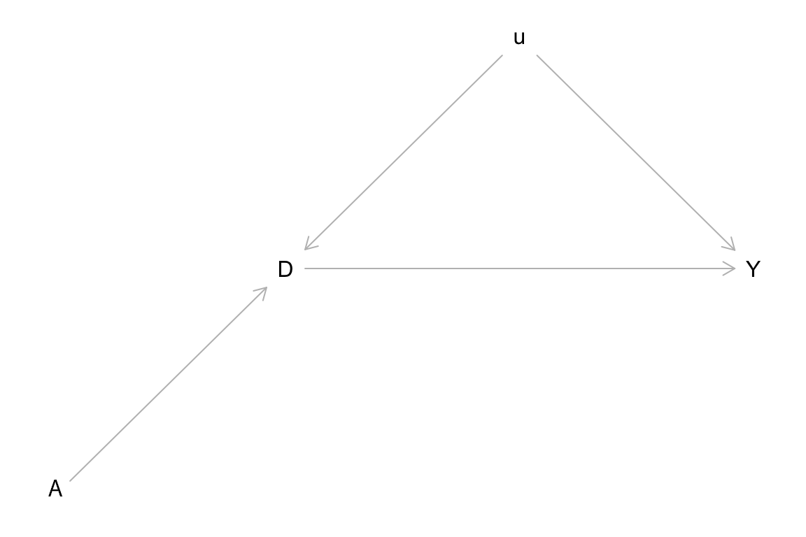

Tutorial-3: Non-compliance in Coupon Field Experiments
================
Xi Chen
2024-06-10

Pleas download `T3_Data.Rdata` for this tutorial.

# Data Description

The data for this tutorial describe the outcome of a field experiment
involving an incentive to join a customer loyalty program. A software
company produces mobile apps using a “freemium” sales model: the base
app is available for free, and add-ons sell for €0.50 each. The company
announced a customer loyalty program. Customers would be able to enroll
in the loyalty program for free, and in return, they would gain access
to early releases of new add-ons, as well as discounts on (as of yet
unspecified) future products. Because the company sold its app via
mobile app stores, it knew the following:

- Who each customer is
- Whether they have enrolled in the loyalty program
- How much revenue each customer generates

The company decided to incentivize some customers to join the loyalty
program. As the decision of joining the loylaty program was rested with
the consumers, the company randomized the incentives (so-called
“encouragement design”). Just prior to the launch of the loyalty program
(i.e., before anybody could sign up), it randomly chose 15% of its
customers and told then that if they enrolled in the loyalty program
when it opened, they would be entered into a drawing to receive one of
10 Amazon gift cards worth €100 each.

To obtain the data from this experiment, run the following code:

``` r
# Load and scan the data.  
load("T3_Data.Rdata")
head(loyalty)
```

    ##      ID A D   Y
    ## 1 00001 0 0 0.5
    ## 2 00002 0 0 0.0
    ## 3 00003 1 1 0.0
    ## 4 00004 0 0 0.0
    ## 5 00005 1 1 0.0
    ## 6 00006 0 0 0.0

The variables are:

- `customer`: a unique identifier for each customer.
- `A`: whether the customer received the incentive to join the loyalty
  program.
- `D`: whether the customer joined the loyalty program.
- `Y`: revenue within the first 3 months after the launch of the loyalty
  program (for the sake of simplicity, assume that customers could only
  enroll when the program was first launched).

# Managerial Background

From the field experiment, the company wants to know a few things:

- Was revenue higher among customers who received the incentive? (This
  is the `intention-to-treat effect of the incentive on revenue`, or
  `ITT_Y`)
- Were customers who received the incentive more likely to join the
  loyalty program? (This is the
  `intention-to-treat effect of the incentive on joining the loyalty program`,
  or `ITT_D`)
- How much did joining the loyalty program increase revenue among
  customers who were nudged into joining the loyalty program by the
  incentive? (This is the complier average causal effect, CACE, which is
  also called the `local average treatment effect`, or `LATE`)
- Was the incentive cost effective?

The company realizes customers who stand to benefit the most from
joining the program are more likely to join it. That is, the change in
revenue from joining the loyalty program is probably correlated with the
decision to join the loyalty program, as illustrated in the DAG below.



# Analysis

First, we will estimate the intention-to-treat effect on joining the
loyalty program, or `ITT_D`. The formula for calculating `ITT_D` is:

$$ITT_D=\frac{\sum {D_{i}^{obs}}\cdot A_i}{\sum {A_i}}-\frac{\sum {D_{i}^{obs}}\cdot \left( 1-A_i \right)}{\sum {\left( 1-A_i \right)}}$$

``` r
ITT_D <- mean(loyalty$D[loyalty$A==1])-
  mean(loyalty$D[loyalty$A==0])
ITT_D
```

    ## [1] 0.410132

This supports that the company has decided a good incentive, as
customers who received the assignment were on average 41% more likely to
join the loyalty program.

Second, we can calculate the intention-to-treat effect on the revenue,
or `ITT_Y`. This calculation gives us the effect of the assignment (or
the incentive of 10 Amazon gift cards, worth in total at €1000). The
formula for calcuating `ITT_Y` is:

$$ITT_Y=\frac{\sum {Y_{i}^{obs}}\cdot A_i}{\sum {A_i}}-\frac{\sum {Y_{i}^{obs}}\cdot \left( 1-A_i \right)}{\sum {\left( 1-A_i \right)}}$$

``` r
ITT_Y <- mean(loyalty$Y[loyalty$A==1])-
  mean(loyalty$Y[loyalty$A==0])
ITT_Y
```

    ## [1] 0.2412221

The assignment (or the incentive) brings in on average 0.241 euros per
customer. To check the cost effectiveness of the assignment, we may
calculate the cost per customer with:

``` r
Cost_A <- 1000/sum(loyalty$A)
Cost_A
```

    ## [1] 0.08653513

The cost per customer is about 0.087 euro, and the benefit is about
0.241. Therefore, the assignment of the incentives is cost-effective.
Although the initial evidence looks positive, the company wants to get
some further insights on the effectiveness of the loyalty program.
Although it is impossible to obtain the ATE or average treatment effect
of a typical customer, the company can still learn about the LATE or the
ATE of those who complied with the assignment. In another word, the
revenue of those who received the incentive and join the loyalty program
minus those who did not receive the incentive and not joint the program.

Note that it is not straightforward to see how LATE is compared to ATE.
LATE may be lower or higher than ATE. The interpretation requires
substantive knowledge. For example, suppose the company believed that
the incentive was really marginal, and those compliers who received the
incentives and joined the loyalty program did so out of their true
loyalty to the company. A reasonable conclusion is the LATE is an
upper-bound effect for ATE.

``` r
LATE <- ITT_Y/ITT_D
LATE
```

    ## [1] 0.5881572

Given the LATE, we may also calculate the potential revenue that would
have been generated, had we assigned all compliers the incentive. For
this we need the proportion of compliers in the experiment, which is
`ITT_D` under the “no defier” assumption.

``` r
Counterfactual_Revenue_Compliers <- LATE*ITT_D*dim(loyalty)[1] 
Counterfactual_Revenue_Compliers
```

    ## [1] 18882.14

# Summary

Experiments under non-compliance require careful treatments. Without any
further assumption, we can learn the effect of the assignment, which may
or may not useful. Yet, in policy evaluation, it seems reasonable to
stop here. To learn more about the effect of the treatment, we need to
make more assumptions: exclusion restrictions and “no defier”. The
interpretation of LATE requires substantive knowledge and the
relationship of LATE with ATE is not always clear.
