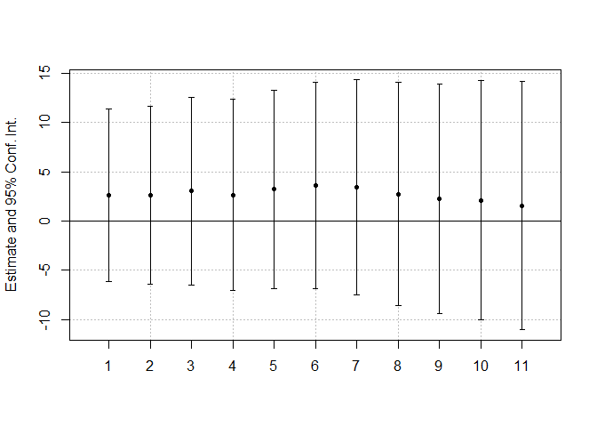
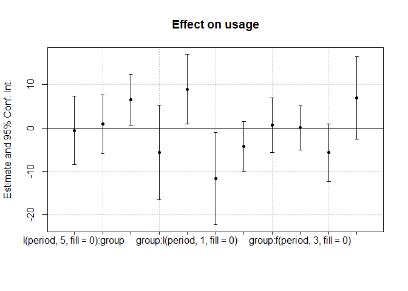

Tutorial-4: DID Aanalysis for Low Carbon London Trial
================
Xi Chen
2023-06-10

Load data `T4_Data.Rdata` and view the data head. For the data
background, please refer to the data description file
`Tutorial 4 - Data Description`.

``` r
load("T4_Data.Rdata")
head(london_trial)
```

    ##   meter_id week_id    usage period group
    ## 1     1002       1 58.78133      0     0
    ## 2     1002       2 50.65400      0     0
    ## 3     1002       3 54.84700      0     0
    ## 4     1002       4 50.83400      0     0
    ## 5     1002       5 62.14000      0     0
    ## 6     1002       6 54.95400      0     0

The data contain a few variables:

- `meter_id`: the smart meter id, each representing a subject of the
  field experiment.
- `week_id`: the id of different weeks.
- `usage`: the outcome variable – the weekly electricity usage in kWh.
- `period`: a dummy variable with 0 - before treatment and 1 - after
  treatment.
- `group`: a dummy variable with 0 - control group and 1 - treated
  group.

# Estimating the ATT

To estimate the ATT, we will use the library `fixest` to run the two-way
fixed effects model. Please install the library before you run the
following codes.

``` r
require(fixest)
```

    ## Loading required package: fixest

    ## Warning: package 'fixest' was built under R version 4.2.3

With the data, we specify a two-way fixed effects regression like this:

$$ usage_{it} = \alpha_i + \lambda_t + \tau \times period*group + \varepsilon_{it} $$

The objective of the estimation is $\tau$.

``` r
# we use R formula here 
# period:group means we add a variable of period*group as IV
# "| meter_id + week_id" is to add time- and individual FEs 
twfe_main <- feols(usage ~ period:group | meter_id + week_id,
           data = london_trial)

# to check the estimation results 
# the standard errors are clustered at meter_id
coeftable(twfe_main)
```

    ##               Estimate Std. Error   t value   Pr(>|t|)
    ## period:group -5.493269   2.831575 -1.940005 0.05264867
    ## attr(,"type")
    ## [1] "Clustered (meter_id)"

From the results, we have an ATT of -5.49, indicating the electricity
usage of the treatment group reduces on average by -5.49kWh each week
under the dynamic pricing.

# Exmaning the paralle trend assumption

Next, we run two sets of analyses to examine whether the pre-trends are
parallel. Hopefully, the checks lend more credibility to the parallel
trend assumption.

## Placebo tests with pseudo-treatments

For the first set of analysis, we focus on the pre-treatment data. We
examine whether pseudo-treatments have an effect in the pre-treatment
period. If yes, it means the pre-treatment trends of the treated and
control are different. Such a difference casts doubts on the credibility
of the parallel trend assumption.

For the placebo tests, we do the following:

- Using the pre-treatment data only;
- Creating a pseudo-treatment by selecting a pre-treatment period as the
  time of treatment.
- Running the two-way fixed effects regression with the pseudo-treatment
  on the pre-treatment data.

The practice below shows results from 11 pseudo-treatments, assuming the
treatment starts at Week 10, 11, …, 20. We create `period` by setting
its value from Week 10 (or 11,..,20) to 25 as 1 and others 0.

``` r
# initialize two vectors to store results 
att_placebo <- c()
se_placebo <- c()

# we will check week 10 to 20 (11 placebo treatments)
for (i in 10:20) {
                        # I(.) to create the pseudo treatment
  twfe_placebo <- feols(usage ~ I(week_id>i):group | meter_id + week_id,
                        #remember to use only pre-trial data
                        data = london_trial[london_trial$period==0, ])
  # obtain the estimation results
  att <- coeftable(twfe_placebo)
  
  # store results in the vectors 
  att_placebo <- c(att_placebo, att[1])
  se_placebo <- c(se_placebo, att[2])
  
}
```

After having the ATTs and their standard errors from the pseudo
treatments, we can use the function `coefplot` to create a plot of the
estimated ATTs and their confidence intervals. Please use `?coefplot` to
see more details about this function.

``` r
coefplot(att_placebo, sd = se_placebo)
```

<!-- -->

From the plot, all the ATTs from the pseudo-ATTs are statistically
insignificant. Therefore, the results support that the pre-trends are
parallel between the treated and control group.

## Event study plots

The second set of analysis for the parallel pre-trends is the event
study plot. To create the plot, we add leads and lags to the main
two-way fixed effects regression. We then examine the coefficients of
these leads and lags, along with the actual treatment. If the pre-trends
are parallel, we expect no significant coefficients for the leads
variables.

In the `fixest` package, we can easily create leads and lags using the
`l(.)` function within the R formula. Please use `?l` for more details.

``` r
# Run the regression with 5 leads and 5 lags
twfe_event <- feols(usage ~ l(period,5:-5,fill = 0):group | meter_id + week_id,
           data = london_trial)
```

With the estimation results, we can create the event study plot with
`coefplot` function.

``` r
coefplot(twfe_event)
```

<!-- -->

The plot shows that lead 3 and lead 5 are both significant. This is
concerning as this indicates some increase on electricity usage for the
treatment group right before the treatment started.

This phenomenon is known as “Ashenfelter’s dip” - the outcome changes in
the opposite direction just before people receive the treatment.
Ashenfelter’s dip makes it clear that participants are systematically
different from non-participants in the pre-treatment period. Overall,
this is alarming.
