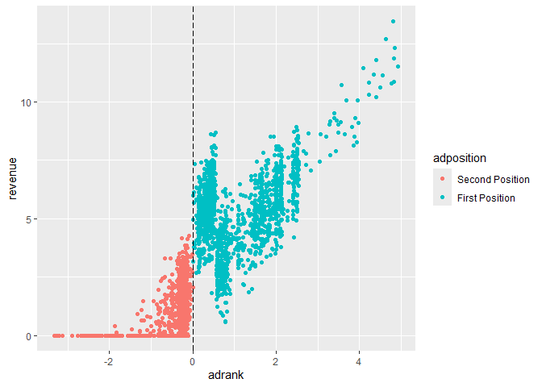
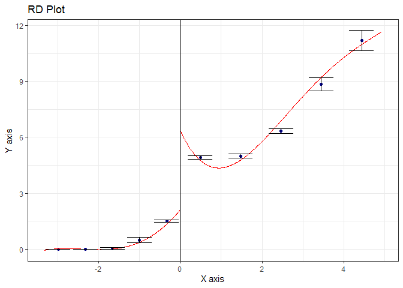
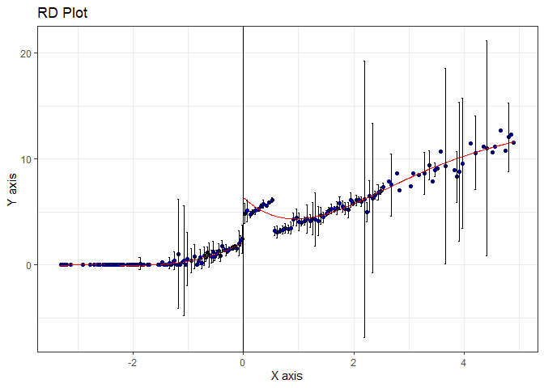
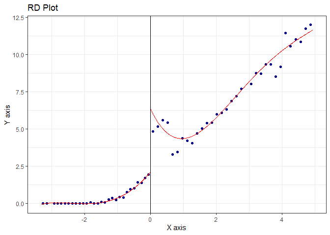

Tutorial-5: RDD for Keywords Bidding
================
Xi Chen
2024-06-09

To follow this R notebook, please download and load data `T5_Data.RData`
from Canvas.

The data contain several variables to measure the position effects of
keywords. The variables are:

- `adrank`: A variable based on the ad rank value which is defined as
  `AdRank = Bidding Price * Quality Score`. This variable is the running
  variable which decides whether the ad position is first or second.
  `adrank variable = own adrank value - neighbor bidder ad rank value`;
  If an advert is ranked first, then this value if positive. If an
  advert is ranked second, then this value is negative. These follow
  directly from the ladder auction setup of keywords bidding.

- `adposition`: A factor of two levels which indicates the positions of
  ads (first and second). The relationship between `adposition` and
  `adrank` variable is: `adposition = 1(adrank>0)`.

- `revenue`: The revenue of the ad campaigns (in log scale)

``` r
load("T5_Data.RData")
head(keyword_bid)
```

    ##       adrank      adposition  revenue
    ## 1 -0.2203159 Second Position 0.844341
    ## 2  1.9997727  First Position 4.991521
    ## 3  0.2777780  First Position 5.854006
    ## 4  1.8701850  First Position 8.508873
    ## 5 -2.9032828 Second Position 0.000000
    ## 6  0.2946558  First Position 4.732809

# Data Visualization

Before running the formal analysis, we first visualize the relationship
between the running variable (`adrank`) and the outcome (`revenue`).
Here, we would like to check whether a “discontinuity” indeed exists in
the relationship between the running variable (`adrank`) and the outcome
(`revenue`). To do so, we produce a scatter plot between `adrank` and
revenue and separate into two groups by `adposition`.

``` r
library(ggplot2)
ggplot(keyword_bid, aes(adrank, revenue, color = adposition)) + 
  geom_point() + geom_vline(xintercept=0, linetype="longdash")
```

<!-- -->

However, this plot is a bit difficult to eyeball. In a RD design, it is
important to visualize the data with a RD plot. RD plots first put the
data into bins and then aggregate the data with bins. For some bandwidth
(the width of the bins) $h$ and for the number of bins $K_0$ to the left
of the cutoff $c$ and $K_1$ to the right. We can construct bins with the
running variable $X_i \in (b_k, b_{k+1}]$, $\forall k=1,\cdots,K_0+K_1$,
where: $$b_k=c-(K_0-k+1)h.$$ The average value of the outcome variable
$Y_k$:
$$\left( \sum_{k=1}^n a_k b_k \right)^2 \leq \left( \sum_{k=1}^n a_k^2 \right) \left( \sum_{k=1}^n b_k^2 \right)$$

We can create such RD plots with the package `rdrobust`, and you can
find the package from the CRAN repository.

``` r
require("rdrobust")
```

    ## Loading required package: rdrobust

One decision about the RD plots is to select the number of bins. On one
hand, too many bins (or narrower bins) represent the original data
better and capture the “jumps” more easily, but the estimates ($Y_k$)
will be highly imprecise. On the other hand, too few bins (or wider
bins) may fail to account for important patterns (jumps) in the data.
This is a very classic “variance-bias” tradeoff.

Let’s try the `rdplot` function with 10 bins.

``` r
rdplot(keyword_bid$revenue, keyword_bid$adrank, 
                      nbins = c(5,5), ci=95)
```

<!-- -->

Let’s try the `rdplot` function with 200 bins.

``` r
rdplot(keyword_bid$revenue, keyword_bid$adrank, 
                      nbins = c(100,100), ci=95)
```

<!-- --> You
can also use the function to obtain the “optimal” bandwidth and the
number of bins:

``` r
rdplot(keyword_bid$revenue, keyword_bid$adrank, binselect = "es")
```

<!-- -->

# Selecting A Bandwidth with Cross-Validation

The most important decision in running a regression discontinuity
analysis is to select the proper bandwidth. The tradeoff here is a
classic statistical termed as “bias-variance balance”. Simply put it,
having a broader window gives us more observations (campaigns), which
gives us more power in our analysis (less variance of the estimated
position effects). On the other hand, a broader window leads to more
samples around the cutoff that may not be “comparable” in the sense of
treatment vs. control in a randomized experiment.

We try to select the “optimal” bandwidth with the cross-validation
method. As our data size is relatively small, we use a 2-fold cross
validation. In your own practice, you can also choose a more general
K-fold cross validation. The optimal bandwidth is the one that has the
smallest mean squared error (MSE) on the testing sample.

For the estimation, we adopt a regression-based estimator of position
effects. This is more of a “show-and-tell.” Other functional forms such
as polynomial or kernel-based estimation are preferred in practice.

To be more specific, we estimate a regression equation like this:

$$Revenue_i=Adposition_i+Adrank_i+Adposition_i\times Adrank_i+e_i$$

The interaction term is included in case the slope of `adrank` on
`revenue` changes in first vs. second position. Note that other specs
can be used, for example a local polynomial regression or the addition
of higher order terms. These are usually added robustness checks, as the
basic spec is easy to interpret.

To put the analysis in R, you are provided a function called `bw_select`
to select the optimal bandwidth. The function takes in three inputs:

- `H`: the bandwidths that you are comparing; a numerical vector.
- `data`: the data frame you used to run the regression equation.
- `model`: a character vector specifying the names of the treatment
  variable (`adposition`), the running variable (`adrank`) and the
  outcome variable (`revenue`) in the \`data. The names must be in the
  order of treatment $\rightarrow$ running variable $\rightarrow$
  outcome.

The function outputs the estimated MSEs at different bandwidths given in
`H`. It’s a numerical vector of the same length as `H`, with each
element corresponding to one bandwidth in `H`.

``` r
# check the function of bandwidth selection  
bw_select
```

    ## function (H, data, model) {
    ##     #=====Inputs of the function----------------------------------------------
    ##     # H: the bandwidths that you are comparing; a numerical vector. 
    ##     # data: the data frame you used to run the regression equation. 
    ##     # model: a character vector specifying the names of the:
    ##         # treatment variable (e.g., "adposition") 
    ##         # the running variable (e.g., "adrank")
    ##         # the outcome variable (e.g., "revenue") in the data. 
    ##     # Note The names must be in the order of c(treatment,running-variable,outcome). 
    ##     
    ##     #===== Step 1 - to split data into test and train set --------------------
    ##     # here we use 2-fold cross-validation. 
    ##     
    ##     # Set seeds for replication 
    ##     set.seed(12345)
    ##     
    ##     # Permutate the index
    ##     N <- dim(data)[1]
    ##     idx <- sample(1:N,N,replace = F)
    ##     
    ##     # To obtain a random subsample as train and test data
    ##     train <- data[idx[1:(N/2)],]
    ##     test <- data[idx[(N/2+1):N],]
    ##     
    ##     #===== Step 2 - To select optimal bandwidths ------------------------------
    ##     
    ##     # a vector to store MSE 
    ##     H.fit <- rep(0,length(H))
    ##     
    ##     
    ##     # Loop over all the possible bandwidths in H
    ##     for (i in 1:length(H)) {
    ##       
    ##       # This is the model specified above. More complex method may be used here. 
    ##       mdl <- lm(as.formula(paste(model[3],"~",model[2],"*",model[1])), # the R formula
    ##                 # selecting samples in the window around the cutoff
    ##                 train[abs(train$adrank)<H[i],]) 
    ##       
    ##       # To obtain the predicted outcome for test data. 
    ##       revenue.hat <- predict(mdl,
    ##                              # selecting samples in the window around the cutoff
    ##                              newdata = test[abs(test$adrank)<H[i],]) 
    ##       
    ##       # To calcualte and store MSE
    ##       H.fit[i] <- mean((test$revenue[abs(test$adrank)<H[i]]-revenue.hat)^2)
    ##     }
    ##     
    ##     # change the names of H.fit for printing purpose
    ##     names(H.fit) <- paste("bw:",
    ##                           as.character(round(H,3)),
    ##                           sep = " ")
    ##     return(H.fit)
    ##     
    ##   }

In this example, for simplicity, we will focus on an `H` containing 4
values based on the standard deviation of `adrank`. In your own
practice, you may choose finer grid. Generally, we set the bandwidth to
a multitude of the standard deviation of the running variable. Here, we
will set four values as the $0.25, 0.5, 1.0, 2.0$ times the standard
deviation of `adrank`

``` r
# getting the vector of bandwidths
H <- c(0.25,0.5,1.0,2.0)*sd(keyword_bid$adrank)

# specifying the model as input for the function bw_select
# in the order of treatment, running variable and outcome
model <- c("adposition", "adrank", "revenue")

# obtain the results of MSEs under different H
H.MSE <- bw_select(H, keyword_bid, model)
H.MSE
```

    ## bw: 0.281 bw: 0.562 bw: 1.124 bw: 2.248 
    ## 0.9215618 0.8409203 1.2379521 1.3695525

# Estimating the Position Effects

After having the MSEs of different bandwidths, we choose the bandwidth
that gives the smallest MSE.

``` r
# to get the bandwidth of the one with minimum MSE
H.optim <- H[H.MSE==min(H.MSE)]

# the optimal bandwidth
H.optim
```

    ## [1] 0.5619815

After having the optimal bandwidth `H.optim`, we rerun the model with
the full data. This gives us a “local average treatment effects” (LATE).
The position effect is measured by the coefficient of `adposition` The
interpretation of the coefficient is if you boost your ad position from
2nd place and 1st place, how much increase you expect in the revenue of
a campaign. You can also extend to different positions by changing the
treatment variable to other positions such as “Position 3 to 2” or
“Position 4 to 3”.

``` r
# rerun a model on full data with bandwidth set to the optimal bandwidth
# H.optim
mdl <- lm(revenue~adrank*adposition,
          keyword_bid[abs(keyword_bid$adrank)<H.optim,])
summary(mdl)
```

    ## 
    ## Call:
    ## lm(formula = revenue ~ adrank * adposition, data = keyword_bid[abs(keyword_bid$adrank) < 
    ##     H.optim, ])
    ## 
    ## Residuals:
    ##     Min      1Q  Median      3Q     Max 
    ## -4.0100 -0.6302  0.0005  0.6349  2.8303 
    ## 
    ## Coefficients:
    ##                                 Estimate Std. Error t value Pr(>|t|)    
    ## (Intercept)                      2.02533    0.08785  23.054  < 2e-16 ***
    ## adrank                           1.99824    0.32495   6.149 1.02e-09 ***
    ## adpositionFirst Position         2.42697    0.13604  17.840  < 2e-16 ***
    ## adrank:adpositionFirst Position  1.08011    0.42983   2.513   0.0121 *  
    ## ---
    ## Signif. codes:  0 '***' 0.001 '**' 0.01 '*' 0.05 '.' 0.1 ' ' 1
    ## 
    ## Residual standard error: 0.9282 on 1369 degrees of freedom
    ## Multiple R-squared:  0.826,  Adjusted R-squared:  0.8256 
    ## F-statistic:  2167 on 3 and 1369 DF,  p-value: < 2.2e-16

To evaluate your bidding strategies, for a campaign, you can track your
bidding record and check the increase of your bidding prices to get your
Position from 2 to 1. For the return of a campaign Approximately, the
expected return per click from Position 2 to 1 is the coefficient of
`adposition` divided by the average number of clicks across the
campaigns.

$$V_{2\rightarrow1}=\dfrac{\beta_{adposition}}{Clicks}$$
