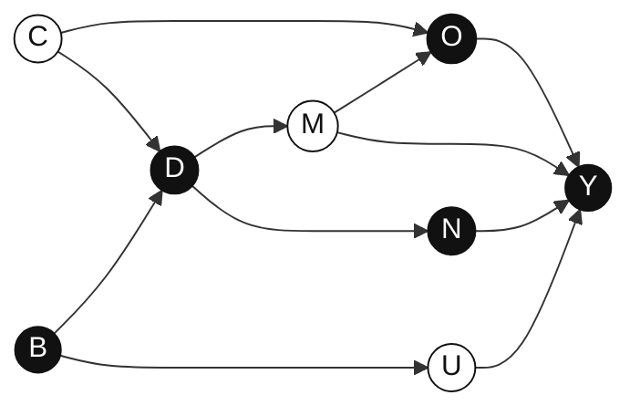

# Final Assignment

> Prepared solely for **Causal Inference at GSERM**. Please do **not** circulate.

## Contents

- [Instructions](#instructions)
- [Part I: Quiz Questions](#part-i-quiz-questions)
  - [Question 1.1: DAG](#question-11-dag-10-points)
  - [Question 1.2: Lord's Paradox](#question-12-lords-paradox-10-points)
  - [Question 1.3: Democrat vs. Republican Presidents](#question-13-democrat-vs-republican-presidents-10-points)
  - [Question 1.4: GenAI Product Description Updates](#question-14-genai-product-description-updates-10-points)
- [Part II: Empirical Questions](#part-ii-empirical-questions)
  - [Data Description](#data-description)
  - [Question 2.1: Propensity Scores](#question-21-propensity-scores-15-points)
  - [Question 2.2: Weighting Estimators](#question-22-weighting-estimators-15-points)
  - [Question 2.3: Heterogeneous Treatment Effects](#question-23-heterogeneous-treatment-effects-20-points)
  - [Question 2.4: Auditing the Identification Strategy](#question-24-auditing-the-identification-strategy-10-points)

---

## Instructions

This is the final integrative assignment for **Causal Inference**. The assignment has two parts:

1. **Quiz questions** on concepts and ideas covered in lectures.
2. **Empirical questions** based on the dataset `AR_data`.

Please download **`CIA.Rdata`** for the assignment. `CIA` is short for **causal inference assignment**.

### Report format guidelines

- Use at least **12pt font size** with minimum **1.5 line spacing**.
- Include a **title page** with your name on it.
- Keep the main report to **no more than 15 pages**, focusing on the most relevant information in the body text.
- Put extra tables and figures in appendices. There is no page limit for appendices.
- Submit your code as an appendix for reference.

### Question types

The assignment includes three general types of questions:

1. Conceptual questions about course concepts and ideas.
2. Questions asking you to present and/or interpret results from data analytics.
3. Questions asking you to draw managerial implications from analytical results.

### Grading criteria for analytical and interpretation questions

For type-2 questions, grading is based on:

1. **Clarity**: your writing is clear and professional.
2. **Accuracy**: your analytical results are accurate.
3. **Rigor**: your interpretations reflect the nature of the analytical results.
4. **Relevance**: your interpretations are specific to the marketing context.

### Grading criteria for managerial implication questions

For type-3 questions, grading is based on:

1. **Clarity**: you explain your conclusions clearly and professionally.
2. **Plausibility**: your conclusions are well-grounded in the analytical results.
3. **Coherence**: your conclusions are logically sound and self-consistent.
4. **Relevance**: your conclusions consider the specific marketing context.

---

# Part I: Quiz Questions

## Question 1.1: DAG (10 points)

**Question:** Please find all the backdoor and front-door paths that link `$D$` and `$Y$` in the DAG above.

---

## Question 1.2: Lord's Paradox (10 points)

A large university is interested in investigating the effects of the diet provided in the university dining halls and any sex differences in these effects. Various types of data are gathered. In particular, the weight of each student at the time of arrival in September and the student's weight the following June are recorded. The data are shown in the table below.

From the table, the average weight for males was 180 in both September and June. Thus, the average weight gain for males was zero. The average weight for females was 130 in both September and June. Thus, the average weight gain for females was zero.

### September weight range and average June weights

| September weight range (pounds) | % of Men | % of Women | Male average June weight | Female average June weight | Male weight gain − female weight gain |
|---:|---:|---:|---:|---:|---:|
| `<100` | 0.2 | 12.4 | 114 | 102 | 12 |
| 100–109 | 0.5 | 10.0 | 120 | 108 | 12 |
| 110–119 | 0.7 | 10.6 | 122 | 110 | 12 |
| 120–129 | 1.7 | 14.5 | 134 | 122 | 12 |
| 130–139 | 2.5 | 13.9 | 146 | 134 | 12 |
| 140–149 | 8.0 | 15.0 | 152 | 140 | 12 |
| 150–159 | 10.0 | 10.4 | 158 | 146 | 12 |
| 160–169 | 15.4 | 5.4 | 166 | 154 | 12 |
| 170–179 | 15.0 | 4.8 | 176 | 164 | 12 |
| 180–189 | 14.8 | 1.8 | 184 | 172 | 12 |
| 190–199 | 14.0 | 1.0 | 191 | 179 | 12 |
| `>200` | 17.2 | 0.2 | 204 | 192 | 12 |

**Question:** What is the differential causal effect of the diet on male weights and on female weights?

Two statisticians from the statistics department debate this question.

**Statistician 1:** Look at gain scores. There is no effect of diet on weight for either males or females, and no evidence of a differential effect between the two sexes, because no group shows any systematic change.

**Statistician 2:** Compare June weight for males and females with the same weight in September. On average, for a given September weight, men weigh more in June than women. Thus, the new diet leads to more weight gain for men.

Please use the potential outcome framework to evaluate the statements of the two statisticians.

First, answer the following questions:

1. What are the treatment units?
2. What are the treatments, or causal states?
3. What is the assignment mechanism?
4. Is the assignment mechanism unconfounded?
5. Is the causal effect identified under the assignment mechanism?

Then, based on these aspects, make your final verdict about the statements of the two statisticians.

---

## Question 1.3: Democrat vs. Republican Presidents (10 points)

The US economy has performed better when the president of the United States is a Democrat rather than a Republican.[^1] But is this difference due to pure chance? To check this, run a permutation test, based on the idea of Fisher's exact test, using the dataset `DR_Gap.csv`.

Each row in the data represents one presidential term of four years. The columns are:

- `Parties`: Democrat vs. Republican (`D` vs. `R`)
- `Presidents`: president names
- `GDP_growth`: GDP growth rate, in percent

In the actual data, the average GDP growth under the 7 Democrat terms is **4.33** and the average GDP growth under the 9 Republican terms is **2.54**. The difference is therefore **1.79**.

To test whether the gap is due to pure chance, follow the steps in Fisher's exact test.

**Question:** Please run the permutation test and report both the histogram and the exact p-value of the test.

> **Hints**
>
> - The null hypothesis is no difference in GDP growth between Democrat and Republican presidents. Under the null, whoever runs a term, the GDP growth for that term would be the same.
> - The test is about the Democrat–Republican gap: average growth under 7 Democrat terms minus average growth under 9 Republican terms. You may randomly assign 7 terms to Democrats and the remaining terms to Republicans.
> - The p-value refers to the percentage of assignments that produce a gap larger than **1.79**.

[^1]: Adapted from Blinder, Alan S., and Mark W. Watson. 2016. “Presidents and the US Economy: An Econometric Exploration.” *American Economic Review*, 106(4): 1015–1045.

---

## Question 1.4: GenAI Product Description Updates (10 points)

Many e-commerce platforms rely on product descriptions to inform consumers, increase engagement, and improve conversion. Recently, content marketing companies have started using Generative AI to create and update product descriptions at scale. Compared with manual updates, GenAI-assisted updates may improve product descriptions by making them more complete, readable, persuasive, or better aligned with consumer search behavior.

A content marketing company wants to evaluate whether GenAI-assisted product description updates improve market outcomes. The company has collected a product-level panel dataset with the following information:

- Product-level market outcomes over time, such as page views, clicks, engagement, add-to-cart behavior, and purchases.
- The timing of GenAI-assisted product description updates.
- The product description before and after each update.
- Product characteristics, product category, and other product-page information.

The data are observed at the product-time level. Some products receive GenAI-assisted description updates, while others do not. Among treated products, the updates occur at different points in time. The main treatment of interest is whether a product receives a GenAI-assisted product description update. The goal is to estimate the overall effect of these updates on market outcomes, rather than to study which specific textual features of the updated descriptions matter.

One challenge is that the update decision may not be fully exogenous. For example, the company may be more likely to update products that are strategically important, products whose pages are already being revised, or products whose demand is expected to change.

**Question:** Based on the data, answer the following two questions:

1. Propose a difference-in-differences or event-study design to identify the effect of GenAI-assisted product description updates on market outcomes. Be specific about:
   - treatment definition,
   - control group,
   - outcome variables,
   - model specification, and
   - identifying assumptions.

   In your answer, discuss how you would handle the fact that different products receive updates at different points in time. **(5 points)**

2. Given the data and the description above, propose a way to assess the main identification assumption of your design. Explain how you would test for pre-trends, no-anticipation effects, or other threats to identification. Also discuss at least one concern related to the endogenous timing of GenAI-assisted updates and how you might address it empirically. **(5 points)**

---

# Part II: Empirical Questions

## Data Description

### Background

Augmented Reality (AR) applications have been on the rise, with virtual “try-before-you-buy” experiences ranging from previewing furniture and products in your home with everyday brands like IKEA and Home Depot, to virtually trying on luxury fashion such as Louis Vuitton and Gucci. Once a nice-to-have feature, AR has quickly become an essential technology for retailers. The COVID-19 pandemic accelerated the shift to digital shopping by roughly five years. According to a Nielsen global survey from 2019, consumers listed Augmented and Virtual Reality as the top technologies they are seeking to assist them in their daily lives. Just over half, **51%**, said they were willing to use this technology to assess products.

However, the real value of AR is still in question. First, the increasing adoption is mainly due to the “black swan event” of the pandemic, which forced many retailers to digitize their businesses, rather than the demonstrated effectiveness of AR applications. For example, some retailers may roll back their AR applications after the pandemic. Second, there are scattered cases of successful AR applications in retailing, but a systematic evaluation is lacking. Third, some retailers have seen downsides of AR applications. For example, one retailer saw an increase in product returns after integrating AR functions into its web shop.

In this assignment, we examine the possible downsides of AR applications in retailing. Specifically, we evaluate the effects of AR applications on product return rates. Product return is a main obstacle for retailers migrating their businesses online. According to some estimates, the return rate for online shopping is around **30%–45%**, whereas the return rate for offline shopping is around **10%**. Consumers often check online return policies carefully before making purchases, which further leads to lax return policies among online retailers. Product return has become a pronounced problem for online retailers. In fact, concerns over product returns have spawned many startups specializing in product return management.

### Variables

To evaluate the effects of AR applications on product returns, an online retailer has shared data recording all purchases over roughly one month. The unit of analysis is a purchase. The data record the cause variable, whether AR was used during the purchase process, and the outcome variable, whether the purchased product was returned. The table below summarizes the variables in the data `AR_data.csv`.

| Variable | Coding | Description |
|---|---|---|
| `id` | numeric | Order ID. |
| `AR_usage` | binary | Usage of AR: `1` = yes, `0` = no. |
| `Country` | factor | Country where the order was placed. |
| `Order_size` | numeric | Total value of the order in euros, standardized. |
| `Payment_method` | factor | Payment method: IDEAL vs. Visa. |
| `New_customers` | binary | Whether the order is from a new customer: `1` = yes, `0` = no. |
| `Old_customers_tenure` | numeric | If the order is from an old customer, the customer's tenure, standardized. |
| `Product_return` | binary | Whether the product from the order is returned: `1` = yes, `0` = no. |
| `Channel` | factor | Channel through which the customer reached the web shop. |
| `Order_day` | factor | Date when the order was placed, across 28 days. |
| `Order_hour` | factor | Hour when the order was placed, across 24 hours. |

### Channel categories

The company categorizes channels into the following types:

1. **Affiliate**: small partners, such as web blogs.
2. **Campaigning**: direct communication channels, such as email.
3. **Direct access**: customer directly enters the website into an internet browser.
4. **Display**: banners and videos online, as well as TV commercials.
5. **Member-get-member**: customers receive a promotion code to attract new customers.
6. **Organic search**: retailer is visible on Google through non-advertised search results.
7. **Paid search branded**: advertised visibility on Google when the customer searches for the retailer.
8. **Paid search non-branded**: advertised visibility on Google when the customer searches for generic terms, such as “buying glasses.”
9. **Paid social**: paid visibility on social media, such as Facebook and Instagram.

### Management problems

The company would like to explore the applications of AR in its web shop. In particular, it raises the following questions:

- Using the data, how can we evaluate the effects of applying AR in the web shop on product returns?
- Does the application of AR in the web shop increase product return rates?
- For which customer groups, or under what situations, does the application of AR increase relative product return rates?

Using the data, you are tasked with evaluating the effects of AR usage on product returns. In particular, the company expects you to use `AR_usage` as the cause variable, `Product_return` as the outcome variable, and the remaining variables as control variables for your analysis.

---

## Question 2.1: Propensity Scores (15 points)

The data exhibit a flat structure with fewer observations, or orders, relative to the number of variables. This is especially true because some variables are discrete. It is therefore difficult to directly apply classic matching methods based on stratification and data trimming. To adopt a conditioning strategy, it is reasonable to first calculate and examine propensity scores.

1. Run a logistic regression with treatment state, `AR_usage`, as the dependent variable, and all control variables as features. Report only the significant features, including coefficients and standard errors. **(10 points)**

   > **Hint:** Use only the main variables. There is no need to add interactions.

2. Given the propensity scores from Question 2.1.1, propose and run a test to examine whether the propensity scores are similarly distributed between the treatment and control groups. **(5 points)**

   > **Hint:** Be specific about the test you propose, the test results, and the conclusion.

---

## Question 2.2: Weighting Estimators (15 points)

With the propensity scores estimated in Question 2.1, estimate the average treatment effect using a weighting approach. Describe how you weight the outcomes, `Product_return`, for the treatment and control groups, and report the estimated ATE and its standard errors.

> **Hint:** Because the outcome variable, `Product_return`, is binary, you cannot apply a linear regression. Instead, try logistic regression with weights, also known as a weighted maximum likelihood approach.

---

## Question 2.3: Heterogeneous Treatment Effects (20 points)

An important managerial problem is to look for heterogeneous treatment effects for different consumers or purchase situations. For example, if AR usage tends to increase product return rates in the morning, the company may find a way to discourage AR usage in the morning.

In this question, you are expected to help the company find possible heterogeneous treatment effects by applying the causal random forest method.

1. Use the generalized random forest package, [`grf`](https://grf-labs.github.io/grf/), to train a causal forest and estimate the average treatment effect. Report:
   - a histogram of the personalized treatment effect predictions, with the median shown;
   - the estimated ATE; and
   - the 95% confidence interval. **(10 points)**

   > **Hints**
   >
   > - The main function for this method is documented here: [`causal_forest`](https://grf-labs.github.io/grf/reference/causal_forest.html).
   > - Use the default setting of the function and set the seed to `123456789`.
   > - You need to transform factors into binary matrices, because the `grf` package does not currently support factors.
   > - Use `predict(...).predictions` to obtain personalized treatment effect predictions.
   > - Use `average_treatment_effect(...)` to obtain the estimated ATE.

2. With the personalized treatment effect predictions, you may test treatment effect heterogeneity with respect to a feature `$X$`. For a simple discrete variable, this may be straightforward. For example, you can compare personalized treatment effect predictions across different levels and examine whether they differ significantly using standard tests such as a two-sample t-test. However, it is less clear how to test heterogeneity for a continuous variable.

   Propose a way to test treatment effect heterogeneity for continuous variables. Be specific about your testing procedure and test statistics. **(5 points)**

3. Apply the testing approach that you proposed in Question 2.3.2 and test whether there is significant heterogeneity with respect to `Order_size` and `Old_customers_tenure`. Report the test results and your conclusions. **(5 points)**

---

## Question 2.4: Auditing the Identification Strategy (10 points)

The identification strategy cited here is the **conditioning strategy**. However, there is always a concern of omitted variable bias. That is, there is always a possibility that an omitted variable exists and biases the estimation. Therefore, you need to audit the identification strategy and add credibility to your analysis.

**Question:** Propose and describe a procedure to examine concerns over omitted variable bias.

> **Hint:** Focus on how your procedure can help examine concerns over omitted variable bias. It is fine to assume that you may ask the company for more data, but be specific about what data you intend to have.
