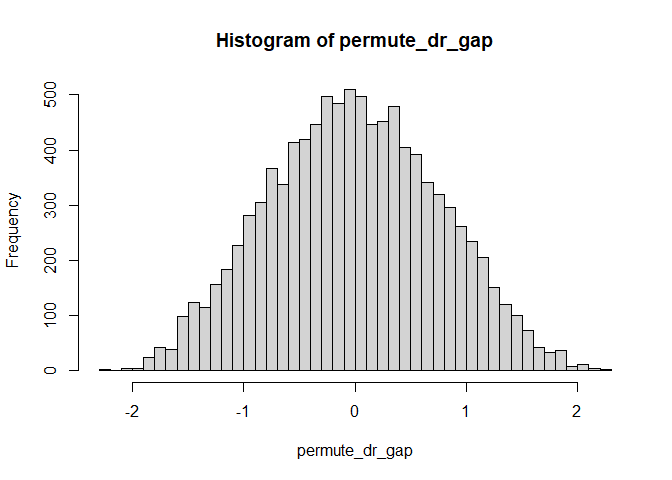

Final assignment - Suggested solutions and rubrics
================
Xi Chen
2024-07-30

# Part I. Quiz Questions

## Question 1.1

### Suggested solutions

The backdoor path is a path which starts with X and ends with Y, with an
arrow into X on one end and an arrow into Y on the other end, $X \leftarrow \cdots \rightarrow Y$
This is the only requirement. Any nodes or links are allowed between X and Y.

The front door path is a path which starts with X and ends with Y, with
an arrow from X on one end and an arrow into Y on the other end, $X \rightarrow \cdots \rightarrow \cdots \rightarrow Y$.
All the nodes in-between must also have a chain relationship.

By these criteria, the backdoor paths are:
1. $D \leftarrow B \rightarrow U \rightarrow Y$,
2. $D \leftarrow C \rightarrow O \rightarrow Y$, and
3. $D \leftarrow C \rightarrow O \leftarrow M \rightarrow Y$.

The front door paths are:
,
,
.

### Rubrics

Each path: 0.7 point.

## Question 1.2

### Suggested solutions

1.  **Units**: students.
2.  **Treatment effects**: the effects of the diet in the university dining
    halls on the weights of students.
3.  **Assignment mechanism**: all students are under the treatment.
4.  The assignment mechanism is **unconfounded** as all people, irrespective
    of their outcomes, are under treatment.
5.  The causal effect is **not identified** as all students are in the same
    causal states.

Both statisticians are wrong, we cannot learn any info. about the causal
effects from the data.

### Rubrics

* Each of the 5 sub-questions: 1.5 points.
* The verdict on the statisticians’ conclusions: 2.5 points.

## Question 1.3

### Suggested solutions

First, we load the data `DR_Gap.csv`.

``` r
library(readr)
DR_Gap <- read_csv("DR_Gap.csv", col_types = cols(...1 = col_skip()))
```

The difference in GDP growths between the democrat and the republican
presidents in the data is:

``` r
true_dr_gap <- mean(DR_Gap$GDP_growth[DR_Gap$Parties=="D"]) - 
  mean(DR_Gap$GDP_growth[DR_Gap$Parties=="R"])
true_dr_gap
```

    ## [1] 1.788413

We now run the permutation analysis:

``` r
set.seed(123) # set the seeds for replication
n <- 10000 # no. of repetitions
permute_dr_gap <- rep(0, n) # a vector to store results

for (i in 1:n) {
  permute_r <- sample(1:16, 9, replace = F) # randomly assign 9 of 16 presidents to republicans
  permute_d <- setdiff(1:16, permute_r)
  permute_dr_gap[i] <- mean(DR_Gap$GDP_growth[permute_d]) - 
    mean(DR_Gap$GDP_growth[permute_r])
}
```

With the permuted GDP gap values, we plot a histogram:

``` r
hist(permute_dr_gap, breaks = 50)
```

<figure>

</figure>

The exact p-value is calculated by the percentage of more extreme values
than the true GDP growth gap:

``` r
dr_gap_exactp <- sum(permute_dr_gap > true_dr_gap) / n
dr_gap_exactp
```

    ## [1] 0.0068

The conclusion is the GDP gap hardly arises by pure chance (0.68% by
random chance).

### Rubrics

The histogram is 5 points. The exact p-value is also 5 points.

## Question 1.4

* A diff-in-diff strategy can make use of two variations:
    1.  **The change of prices in minable cryptocurrencies over time**. For example, we can identify some change points in the prices of
    cryptocurrencies and use the before time as “before treatment” and the after time as “after treatment.”
    2.  **For the other variation of the treated vs. non-treated, we can make use of the fact only GPU prices are responsive to the prices of cryptocurrencies** as the     GPUs are the main parts that are used by miners. So, we use GPUs as “treated”, and CPUs or RAMs as “untreated”.
* The model is a **linear panel data regression with individual- and time-fixed effects**.
* The main assumptions is **the parallel trend assumption that the prices of GPUs, CPUs and RAMs would exhibit the same differences in trends**, had the prices of cryptocurrencies remained the same.
    1. One way to assess the assumption is the knowledge that prices of the non-minable cryto-currencies should NOT influence the prices of the GPUs. This is     called a “pseudo-treatment.” If we run the analysis again with the non-minable cryto-currencies, we should not find any treatment effect if our identification strategy is valid.

### Rubrics

* For the DiD design, the data (treatment vs. control, before vs. after)
each 1.5 points.
* The model and assumption is 1 point each.
* For the assessment of the assumption, it’s 5 points.

# Part II. Emiprical Questions

We first load the data into R”

``` r
load("CIA.RData")
head(data)
```

    ##   id AR_usage Country  Order_size Payment_method New_customers
    ## 1  1        0      NL -0.31236710          ideal             1
    ## 2  2        1      NL -0.65872429          ideal             1
    ## 3  3        0      NL -1.32286420          ideal             1
    ## 4  4        0      NL  0.06285319          ideal             0
    ## 5  5        1      NL  1.56373435          ideal             0
    ## 6  6        0      NL -0.45668259          ideal             1
    ##   Old_customers_tenure Product_return                 Channel Order_day
    ## 1           -0.6938418              0 Paid Search Non-Branded         4
    ## 2           -0.6938418              0     Paid Search Branded         4
    ## 3           -0.6938418              0 Paid Search Non-Branded         4
    ## 4           -0.2612690              0     Paid Search Branded         4
    ## 5           -0.3501792              1          Organic Search         4
    ## 6           -0.6938418              0           Direct Access         4
    ##   Order_hour
    ## 1          1
    ## 2          1
    ## 3          1
    ## 4          1
    ## 5          4
    ## 6          7

## Question 2.1

### Suggested solutions

We first run a logistic regression to obtain the propensity score:

``` r
ps_logit <- glm(AR_usage ~ .-id-Product_return, data, family = binomial(link = "logit"))
summary(ps_logit)
```

    ## 
    ## Call:
    ## glm(formula = AR_usage ~ . - id - Product_return, family = binomial(link = "logit"), 
    ##     data = data)
    ## 
    ## Deviance Residuals: 
    ##     Min       1Q   Median       3Q      Max  
    ## -1.6904  -1.0053  -0.8194   1.2638   2.3575  
    ## 
    ## Coefficients:
    ##                                 Estimate Std. Error z value Pr(>|z|)    
    ## (Intercept)                    -1.749583   0.318821  -5.488 4.07e-08 ***
    ## CountryBE                       0.094584   0.142314   0.665  0.50630    
    ## Order_size                      0.036565   0.025040   1.460  0.14423    
    ## Payment_methodvisa             -0.162811   0.094068  -1.731  0.08349 .  
    ## New_customers                   0.373898   0.071702   5.215 1.84e-07 ***
    ## Old_customers_tenure           -0.054209   0.036459  -1.487  0.13705    
    ## ChannelCampaigning              0.615143   0.217906   2.823  0.00476 ** 
    ## ChannelDirect Access            0.060751   0.192341   0.316  0.75212    
    ## ChannelDisplay                  0.094209   0.661981   0.142  0.88683    
    ## ChannelMember-get-member       -1.258757   0.442005  -2.848  0.00440 ** 
    ## ChannelOrganic Search           0.517723   0.192713   2.687  0.00722 ** 
    ## ChannelPaid Search Branded      0.583335   0.187710   3.108  0.00189 ** 
    ## ChannelPaid Search Non-Branded  0.269751   0.198670   1.358  0.17453    
    ## ChannelPaid Social              0.743837   0.339411   2.192  0.02841 *  
    ## Order_day5                      0.342802   0.205388   1.669  0.09511 .  
    ## Order_day6                      0.133910   0.205920   0.650  0.51550    
    ## Order_day7                      0.452596   0.211071   2.144  0.03201 *  
    ## Order_day8                      0.345366   0.186273   1.854  0.06373 .  
    ## Order_day9                      0.264162   0.182592   1.447  0.14797    
    ## Order_day10                     0.315904   0.177626   1.778  0.07533 .  
    ## Order_day11                     0.091202   0.184149   0.495  0.62042    
    ## Order_day12                     0.006794   0.191787   0.035  0.97174    
    ## Order_day13                     0.102301   0.198620   0.515  0.60651    
    ## Order_day14                     0.447210   0.196360   2.278  0.02276 *  
    ## Order_day15                     0.203050   0.193192   1.051  0.29325    
    ## Order_day16                    -0.058417   0.188546  -0.310  0.75669    
    ## Order_day17                     0.117730   0.182381   0.646  0.51859    
    ## Order_day18                     0.047022   0.183900   0.256  0.79819    
    ## Order_day19                    -0.156049   0.190275  -0.820  0.41215    
    ## Order_day20                    -0.094844   0.190158  -0.499  0.61795    
    ## Order_day21                     0.309864   0.191442   1.619  0.10554    
    ## Order_day22                     0.432575   0.185092   2.337  0.01944 *  
    ## Order_day23                     0.138799   0.183814   0.755  0.45019    
    ## Order_day24                     0.319581   0.207448   1.541  0.12343    
    ## Order_day25                     0.385338   0.222935   1.728  0.08390 .  
    ## Order_day26                     0.543966   0.207857   2.617  0.00887 ** 
    ## Order_day27                     0.210850   0.181509   1.162  0.24538    
    ## Order_day28                     0.209199   0.180750   1.157  0.24711    
    ## Order_day29                     0.401256   0.177117   2.265  0.02348 *  
    ## Order_day30                     0.362763   0.172067   2.108  0.03501 *  
    ## Order_day31                     0.244466   0.190546   1.283  0.19950    
    ## Order_hour1                     0.651023   0.365762   1.780  0.07509 .  
    ## Order_hour2                     0.970414   0.453840   2.138  0.03250 *  
    ## Order_hour3                    -0.196580   0.855968  -0.230  0.81836    
    ## Order_hour4                     1.432022   0.553277   2.588  0.00965 ** 
    ## Order_hour5                    -0.622033   0.818064  -0.760  0.44703    
    ## Order_hour6                     0.721773   0.445767   1.619  0.10541    
    ## Order_hour7                     0.250353   0.347453   0.721  0.47119    
    ## Order_hour8                     0.303358   0.290218   1.045  0.29590    
    ## Order_hour9                     0.431822   0.252396   1.711  0.08710 .  
    ## Order_hour10                    0.475999   0.242447   1.963  0.04961 *  
    ## Order_hour11                    0.518470   0.239309   2.167  0.03027 *  
    ## Order_hour12                    0.431357   0.237157   1.819  0.06893 .  
    ## Order_hour13                    0.455013   0.237365   1.917  0.05525 .  
    ## Order_hour14                    0.500743   0.236675   2.116  0.03437 *  
    ## Order_hour15                    0.344461   0.236851   1.454  0.14585    
    ## Order_hour16                    0.412294   0.235948   1.747  0.08057 .  
    ## Order_hour17                    0.623212   0.235689   2.644  0.00819 ** 
    ## Order_hour18                    0.331634   0.243711   1.361  0.17359    
    ## Order_hour19                    0.682479   0.237612   2.872  0.00408 ** 
    ## Order_hour20                    0.748348   0.235485   3.178  0.00148 ** 
    ## Order_hour21                    0.709077   0.236343   3.000  0.00270 ** 
    ## Order_hour22                    0.504720   0.241353   2.091  0.03651 *  
    ## Order_hour23                    0.191635   0.264594   0.724  0.46890    
    ## ---
    ## Signif. codes:  0 '***' 0.001 '**' 0.01 '*' 0.05 '.' 0.1 ' ' 1
    ## 
    ## (Dispersion parameter for binomial family taken to be 1)
    ## 
    ##     Null deviance: 9818.3  on 7337  degrees of freedom
    ## Residual deviance: 9513.0  on 7274  degrees of freedom
    ## AIC: 9641
    ## 
    ## Number of Fisher Scoring iterations: 4

Next, we obtain the propensity score and test the differences between
the treated and control group:

``` r
ps <- predict(ps_logit,type = "response")
ks.test(ps[data$AR_usage==1],ps[data$AR_usage==0],alternative = "two.sided")
```

    ## 
    ##  Two-sample Kolmogorov-Smirnov test
    ## 
    ## data:  ps[data$AR_usage == 1] and ps[data$AR_usage == 0]
    ## D = 0.17005, p-value < 2.2e-16
    ## alternative hypothesis: two-sided

Here, a two-sample K-S test is used. Other tests can also be used. A
test that compares the whole distribution is preferred over those
comparing means, such as a t-test.

### Rubrics

The regression results need to be consistent with the suggested
solutions. For the test, you can use any test that can examine the
distributional differences in the propensity scores.

## Question 2.2

To obtain the ATE, we first obtain the weights for treated and control
units. For ATE, we weight the treatment group and control group by $\dfrac{1}{e}$ and $\dfrac{1}{1-e}$, respectively.

``` r
wts <- ifelse(data$AR_usage==1,1/ps,1/(1-ps))
```

Given the weights, we run a logistic regression as below:

``` r
ate_logit <- glm(Product_return ~ .-id, data, 
                 family = quasibinomial(link ="logit"), 
                 weights = wts)
summary(ate_logit)
```

    ## 
    ## Call:
    ## glm(formula = Product_return ~ . - id, family = quasibinomial(link = "logit"), 
    ##     data = data, weights = wts)
    ## 
    ## Deviance Residuals: 
    ##     Min       1Q   Median       3Q      Max  
    ## -5.8270  -0.8036  -0.6792  -0.5502   4.8893  
    ## 
    ## Coefficients:
    ##                                  Estimate Std. Error t value Pr(>|t|)    
    ## (Intercept)                     -1.164014   0.392247  -2.968  0.00301 ** 
    ## AR_usage                         0.003963   0.070345   0.056  0.95507    
    ## CountryBE                       -0.502311   0.241526  -2.080  0.03758 *  
    ## Order_size                       0.203070   0.034079   5.959 2.66e-09 ***
    ## Payment_methodvisa              -0.132351   0.139497  -0.949  0.34277    
    ## New_customers                    0.118378   0.103558   1.143  0.25303    
    ## Old_customers_tenure             0.006076   0.051900   0.117  0.90680    
    ## ChannelCampaigning              -0.381825   0.306927  -1.244  0.21353    
    ## ChannelDirect Access            -0.145806   0.253646  -0.575  0.56542    
    ## ChannelDisplay                  -0.278928   0.978447  -0.285  0.77560    
    ## ChannelMember-get-member        -1.208506   0.618235  -1.955  0.05065 .  
    ## ChannelOrganic Search            0.062157   0.254086   0.245  0.80675    
    ## ChannelPaid Search Branded      -0.138796   0.247573  -0.561  0.57507    
    ## ChannelPaid Search Non-Branded   0.003071   0.263430   0.012  0.99070    
    ## ChannelPaid Social               0.209192   0.451156   0.464  0.64289    
    ## Order_day5                       0.099611   0.274555   0.363  0.71676    
    ## Order_day6                      -0.029215   0.277152  -0.105  0.91605    
    ## Order_day7                       0.017307   0.284175   0.061  0.95144    
    ## Order_day8                      -0.401704   0.268349  -1.497  0.13445    
    ## Order_day9                       0.022787   0.243195   0.094  0.92535    
    ## Order_day10                     -0.193362   0.245606  -0.787  0.43114    
    ## Order_day11                     -0.239153   0.257820  -0.928  0.35365    
    ## Order_day12                      0.084831   0.253018   0.335  0.73743    
    ## Order_day13                     -0.290549   0.282430  -1.029  0.30363    
    ## Order_day14                      0.054330   0.263861   0.206  0.83687    
    ## Order_day15                     -0.117081   0.263926  -0.444  0.65733    
    ## Order_day16                     -0.201054   0.257797  -0.780  0.43548    
    ## Order_day17                     -0.224713   0.253324  -0.887  0.37508    
    ## Order_day18                     -0.382519   0.263185  -1.453  0.14615    
    ## Order_day19                     -0.292869   0.265229  -1.104  0.26954    
    ## Order_day20                     -0.337154   0.266871  -1.263  0.20650    
    ## Order_day21                     -0.045757   0.259564  -0.176  0.86008    
    ## Order_day22                     -0.218439   0.260559  -0.838  0.40186    
    ## Order_day23                     -0.042329   0.248497  -0.170  0.86475    
    ## Order_day24                     -0.249702   0.294215  -0.849  0.39607    
    ## Order_day25                     -0.100952   0.308499  -0.327  0.74350    
    ## Order_day26                     -0.245692   0.301344  -0.815  0.41492    
    ## Order_day27                     -0.323738   0.257760  -1.256  0.20917    
    ## Order_day28                     -0.021918   0.244153  -0.090  0.92847    
    ## Order_day29                     -0.135141   0.242897  -0.556  0.57797    
    ## Order_day30                     -0.379951   0.243153  -1.563  0.11819    
    ## Order_day31                     -0.036240   0.257116  -0.141  0.88792    
    ## Order_hour1                      0.548991   0.402681   1.363  0.17282    
    ## Order_hour2                     -0.022509   0.557581  -0.040  0.96780    
    ## Order_hour3                    -12.552328 224.623746  -0.056  0.95544    
    ## Order_hour4                      0.097114   0.621897   0.156  0.87591    
    ## Order_hour5                     -1.383658   1.383551  -1.000  0.31731    
    ## Order_hour6                     -1.382763   0.870111  -1.589  0.11206    
    ## Order_hour7                     -0.602019   0.462157  -1.303  0.19274    
    ## Order_hour8                     -1.045197   0.413425  -2.528  0.01149 *  
    ## Order_hour9                     -0.551117   0.307413  -1.793  0.07305 .  
    ## Order_hour10                    -0.774748   0.297446  -2.605  0.00922 ** 
    ## Order_hour11                    -0.743958   0.291264  -2.554  0.01066 *  
    ## Order_hour12                    -0.375401   0.276775  -1.356  0.17503    
    ## Order_hour13                    -0.853245   0.289104  -2.951  0.00317 ** 
    ## Order_hour14                    -0.758962   0.285060  -2.662  0.00777 ** 
    ## Order_hour15                    -0.461398   0.276693  -1.668  0.09545 .  
    ## Order_hour16                    -0.302205   0.272837  -1.108  0.26805    
    ## Order_hour17                    -0.405154   0.276051  -1.468  0.14223    
    ## Order_hour18                    -0.488442   0.290566  -1.681  0.09281 .  
    ## Order_hour19                    -0.536644   0.281562  -1.906  0.05670 .  
    ## Order_hour20                    -0.695285   0.282437  -2.462  0.01385 *  
    ## Order_hour21                    -0.383389   0.277208  -1.383  0.16670    
    ## Order_hour22                    -0.289893   0.281434  -1.030  0.30302    
    ## Order_hour23                    -0.681054   0.332021  -2.051  0.04028 *  
    ## ---
    ## Signif. codes:  0 '***' 0.001 '**' 0.01 '*' 0.05 '.' 0.1 ' ' 1
    ## 
    ## (Dispersion parameter for quasibinomial family taken to be 2.021588)
    ## 
    ##     Null deviance: 11382  on 7337  degrees of freedom
    ## Residual deviance: 11115  on 7273  degrees of freedom
    ## AIC: NA
    ## 
    ## Number of Fisher Scoring iterations: 12

Note that the coefficient estimate of AR_usage is NOT the average
treatment effect on the Product_return, but the effect of AR_usage on
the log odds ratio. To obtain the ATE on the product return, we need to
predict the counterfactuals for all orders and then calculate the
partial effects.

``` r
# obtain a new data set with counterfactual AR usage
new_data <- data 
new_data$AR_usage <- 1 - new_data$AR_usage

# with the ate_logit model, predict the likelihood of product returns
cf_product_return <- predict(ate_logit, newdata = new_data, type = "response")

# predict the casewise treatment effects
ate_i <- ifelse(data$AR_usage==1,
              data$Product_return - cf_product_return,
              cf_product_return - data$Product_return)

# to take the mean for ate 
ATE_weighting <- mean(ate_i)
ATE_weighting
```

    ## [1] 0.0004824253

``` r
# to obtain the Neyman s.e.
idx <- data$AR_usage==1
ATE_weighting_se <- sqrt((sd(ate_i[idx])^2)/sum(idx)
                         +(sd(ate_i[!idx])^2)/sum(!idx))  
ATE_weighting_se
```

    ## [1] 0.008039866

### Rubrics

- For the estimation using the weighted logistic model, the coefficients
  and standard error of AR_usage are 2.5 point each. The results should
  be similar to what reported in the notebook.
- For the calculation of ATE, the estimate should be similar to the
  reported value in the notebook. The ATE value is 5.0 point.
- Here I use the Neyman s.e. idea. Other s.e. ideas for ATE are also
  applicable. The calculation of standard error is tricky. The most
  “legit” approach is to use a boostrapping procedure by repeated
  estimate the model, and then obtain the counterfactual calculations.
  This will consider both the errors from the model calibration and the
  sampling. To save trouble, I did not use the boostrapping procedure.
- The s.e. is 5.0 point.

## Question 2.3

### Suggested solutions

We first transform the categorical variables of the data into dummies as
the `grf`package does not take categorical variables.

``` r
X <- model.matrix(~ Country + Payment_method + Channel + Order_day + Order_hour - 1, data)
X <- as.data.frame(X)
```

Load the `grf` package and train a causal random forest.

``` r
library("grf")
mdl_grf <- causal_forest(cbind(X,data[,c(4,6,7)]),
                         data$Product_return,
                         data$AR_usage,
                         seed = 123456789)
# Obtain the ATE 
ate_grf <- average_treatment_effect(mdl_grf)
ate_grf
```

    ##    estimate     std.err 
    ## 0.001877030 0.008226805

From the ATE and the std. error we can calculate the 95% confidence
interval:

``` r
ate_ci <- c(ate_grf[1]-2*ate_grf[2],
            ate_grf[1]+2*ate_grf[2])
ate_ci
```

    ##    estimate    estimate 
    ## -0.01457658  0.01833064

There are many ways to test the treatment heterogeneity of continuous
variables. For example, one may use a non-parametric regression. This is
the approach adopted here. In particular, I use a kernel smoother. Note
that we are looking into the possible existence of treatment
heterogeneity. The linear regression does not tell you how the
heterogeneity is statistically like. The kernel smoother considers
non-linearity in the distribution. For the kernel smoother, I use the
order size (or tenure) as the IV and the personalized ATE from the
random forest as the DV. This regression will “partial out” the effect
of order size (or tenure).

After building the kernel smoother, I obtain the prediction for each
observation the predicted personalized ATE. With that, I run a post-hoc
F-stats to see how much the order size (or tenure) are predictive of the
personalized ATE.

``` r
# first obtain the personalized treatment effects
pate_grf <- predict(mdl_grf)$predictions

# kernel smoother to get the "singled out" ATE for order size and tenure
het_order_size <- ksmooth(data$Order_size, pate_grf)
het_tenure <- ksmooth(data$Old_customers_tenure, pate_grf)

# with the singled out ATE, getting the predicted values for each 
n <- dim(data)[1]
y_order_size <- rep(0,n)
y_tenure <- rep(0,n)

for(i in 1:n) {
  
  # the predicted value is the one that has the smallest difference between the observed order size / tenure and the ones in the kernel smoothed values. 
  y_order_size[i] <- 
    het_order_size$y[which.min(abs(data$Order_size[i]
                                   -het_order_size$x))]
  y_tenure[i] <- 
    het_tenure$y[which.min(abs(data$Old_customers_tenure[i]
                               -het_tenure$x))]
  }

# calculate the F-stats 
F_order_size <- (n-2)*
  (var(pate_grf)-var(pate_grf-y_order_size))/
  var(pate_grf-y_order_size)
F_order_size
```

    ## [1] 2528.135

``` r
F_tenure <- (n-2)*
  (var(pate_grf)-var(pate_grf-y_tenure))/
  var(pate_grf-y_tenure)
F_tenure
```

    ## [1] 153.5452

Both F-stats are large, so we have sufficient heterogeneity for the
order size and tenure.

### Rubrics

#### Question 2.3.1

- For the estimation, as the growing of trees is random. Even with the
  same seeds, different machines may produce different results.
- As long as the estimates and standard errors are more or less the
  same, it’s fine.
- The estimate of ATE is 5.0 points and CI 5.0 points.

#### Question 2.3.2

- Many types of tests can be used here. For example, a simple
  correlation coefficient may be used (but not recommended as
  correlation assumes linearity). Another approach is to bin continuous
  variables (order size or customer tenure) and do tests such as MANOVA
  or a regression from there. Some curve learning methods such as the
  nearest neighbor approach may also be use. Overall, there is no
  “standard” ways for testing. However, in general, more flexible
  approaches are more appreciated.
- Each test is 2.5 points and in total 5.0 points.

#### Question 2.3.3

- Check if the methods proposed in Question 2.3.2 are properly applied.
  Check the R codes in the appendix.
- Depending on the estimated personalized treatment effects and the
  methods used, the conclusions might be different.
- As long as the methods make sense and the computation is without
  errors, it’s fine.

## Question 2.4

### Suggested solutions

To examine the credibility of the identification assumption, i.e.,
conditional unconfoundedness, there are several ways:

- Find a pseudo-outcome that is not influenced by the treatment of AR
  usage;
- Find a pseudo-treatment that is not influenced by AR usage;
- Using a bounding approach and make alternative assumptions. For
  example, we may assume positive selection, or consumers who use AR in
  their purchases are not totally sure about the products and thus have
  a higher potential outcome (under control condition) compared to those
  who do not use AR. Then check whether the estimated bounds cover zeros
  (the null effect is possible).
- Using a sensitivity analysis by assuming there is an omitted variables
  and change the variance of the variables. The idea is to show the ATE
  estimate is relatively robust with an omitted variable with reasonable
  variance.

### Rubrics

- One of the approaches is needed for this question.
- Check the internal validity and logic flow of the arguments.
- Follow the grading criteria on the 2nd page of the assignment for the
  grading.
