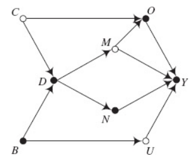
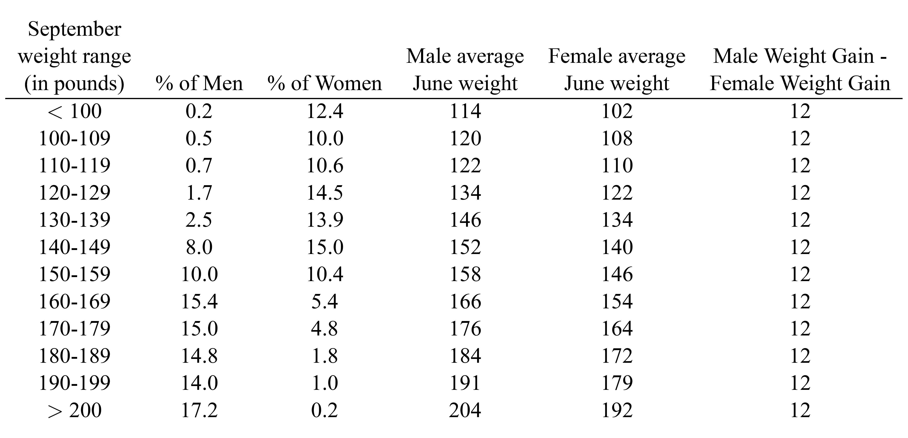

### Instructions

This is the final integrative assignment for Causal Inference. This
assignment includes two parts. In the first part of the assignment, you
will be working on some quiz questions. In the second part, you are
given a dataset for a number of empirical questions. Please download
“**CIA.Rdata**” for the second part (short for “causal inference
assignment”).

For the report format of the assignment, here are some general
guidelines:

-   *At least 12pt font size with minimum 1.5 lines spacing.*

-   *A title page with your name on it.*

-   *No more than 15 pages with most relevant information in the body
    text.*

-   *Extra tables and figures as appendices (no page limit for the
    appendix).*

-   *Please also submit your codes, as an appendix of your assignment,
    for reference.*

In the assignment, you will have three general types of questions: 1)
conceptual questions about various concepts or ideas covered in
lectures, 2) questions asking you to present and/or interpret the
results from data analytics and 2) questions asking you to draw
managerial implications from analytical results. Below are the general
criteria used in the grading.

For the type-2 questions, the grading is based on:

1.  \[Clarity\]: your writing is clear and professional;

2.  \[Accuracy\]: your analytical results are accurate;

3.  \[Rigor\]: your interpretations reflect the nature of the analytical
    results;

4.  \[Relevance\]: your interpretations are specific to the marketing
    contexts.

For the type-3 questions, the grading is based on:

1.  \[Clarity\]: you explain your conclusions in a clear and
    professional way;

2.  \[Plausibility\]: your conclusions are well-grounded in the
    analytical results;

3.  \[Coherence\]: your conclusions are logically sound and
    self-consistent;

4.  \[Relevance\]: your conclusions consider the specific marketing
    contexts.

# Quiz Questions

### Question 1.1 DAG (10 points)

<figure>

</figure>

**Please find all the backdoor and front-door paths that link *D* and
*Y* in the DAG above**.

### Question 1.2 Lord’s Paradox (10 points)

A large university is interested in investigating the effects on the
students of the diet provided in the university dining halls and any sex
differences in these effects. Various types of data are gathered. In
particular, the weight of each student at the time of his \[or her\]
arrival in September and his \[or her\] weight the following June are
recorded. The data are shown in the table below.

From the table, the average weight for Males was 180 in both September
and June. Thus, the average weight gain for Males was zero. The average
weight for Females was 130 in both September and June. Thus, the average
weight gain for Females was zero.

<figure>

</figure>

**Question: What is the differential causal effect of the diet on male
weights and on female weights?**

Two statisticians from the stats department debate about this question.

**Statistician 1**: Look at gain scores: No effect of diet on weight for
either males or females, and no evidence of differential effect of the
two sexes, because no group shows any systematic change.

**Statistician 2**: Compare June weight for males and females with the
same weight in September: On average, for a given September weight, men
weigh more in June than women. Thus, the new diet leads to more weight
gain for men.

Please use the potential outcome framework to evaluate the statements of
the two statisticians. **First, try to answer the following questions**:

1.  What are the treatment units?

2.  What are the treatments (or causal states)?

3.  What is the assignment mechanism?

4.  Is the assignment mechanism unconfounded?

5.  Is the causal effect identified under the assignment mechanism?

**Based on these aspects, make your final verdict about the statements
of the two statisticians.**

### Question 1.3 Democrat vs. Republican Presidents (10 points)

The US economy has performed better when the president of the United
States is a Democrat rather than a Republican[^2]. But is this
difference due to pure chance? To check this, we may run a permutation
test (based on the idea of Fisher’s exact test), using the dataset
“DR_Gap.csv” (you can find the data in the assignment folder). In the
data, there are two columns, and per row stands for one term of
presidency (4 years). The columns are:

-   Parties: Democrat vs. Republican (D vs. R);

-   Presidents: the names of the presidents;

-   GDP_growth: the GDP growth rate (in %).

Under the actual data, the average GDP growth under the 7 Democrat terms
is 4.33 and that under the 9 Republican terms is 2.54, the difference is
1.79. To test if the gap is by pure chance, we may follow the steps in
Fisher’s exact test. **Please run the permutation test and report the
histogram and exact p-value of the test**.

Hints:

-   The null hypothesis is no difference in
    GDP growth between D and R. So, under $H0$, the GDP growth
    will be the same for a term whether the president is from D or R. 

-   The test is about the D-R gap, or average
    growth under 7 D terms minus that under 9 R terms. So, you may
    randomly assign 7 terms to D and the remaining to R. 

-   The p-value refers to % of assignments
    that produce a gap larger than 1.79.

### Question 1.4 Ethereum Effect (10 points)

In recent years, due to the price rise of cryptocurrency, including
Bitcoins and Ethers, among others, the cryptocurrency mining activities
have been greatly increased. Mining is a validation of transactions,
which essentially requires running complex hashing algorithms.
Cryptocurrency miners thus require access to computing power. The most
cost-effective approach is to use graphics cards (or GPUs). Concurrently
around 2017, the prices of GPUs started increasing, and popular
favorites of cryptocurrency miners such as Nvidia’s GTX 1060 and 1070
graphics cards, as well as AMD’s RX 570 and RX 580 GPUs, doubled or
tripled in price – or were out of stock. This is known as Ethereum
Effect, or the effect of the prices of cryptocurrency on GPU prices. 

To quantify the effect, the European Consumer Centers, gathered a
database with the following information:

-   CPU, GPU, and RAM prices at SKU-level;

-   Prices of 15 main cryptocurrencies.

The data is time-series at daily level, from Jan 1, 2017 to Dec 31,
2018. In addition, we know during the time 2017-2018, only some
cryptocurrency could be mined. For example, Bitcoin, DASH, Dogecoin,
Ethereum, Litecoin, and Monero are mineable. Cardano, EOS, IOTA, TRON,
Tether, NEM, Stellar, and Ripple are non-mineable.

**Based on the data, please answer the following two questions**:

-   Propose a difference-in-difference design to identify the Ethereum
    Effect. Please be specific about the data you are using, the
    model(s) and the assumptions you are making (5 points).

-   Given the data and the description above, propose a way to assess
    the main assumption of the DID design (5 points).

# Empirical Questions

### Data Description

#### Background

Augmented Reality (AR) applications have been on the rise with virtual
“try-before-you-buy” experiences ranging from previewing furniture and
products in your home with everyday brands like IKEA and Home Depot, to
virtually trying on luxury fashion such as Louis Vuitton and Gucci. Once
a nice-to-have feature, AR has quickly become an essential technology
for retailers. And the Covid-19 the pandemic has accelerated the shift
to digital shopping by roughly five years. According to a Neilsen global
survey from 2019, consumers listed Augmented and Virtual Reality as the
top technologies they’re seeking to assist them in their daily lives. In
fact, just over half (51%) said they were willing to use this technology
to assess products.

However, the real value of AR is still in question. First of all, the
increasing adoption is mainly due to the “black swan event” of the
pandemic, which “forced” many retailers to digitize their businesses,
but not the effectiveness of AR applications. For example, some
retailers may roll back their AR applications after the pandemic.
Second, there are scattered cases of successful AR applications in
retailing, but a systematic evaluation is lacking. Third, some retailers
have seen some downsides of AR applications. For example, one retailer
had seen an increase in product returns after integrating AR functions
into their web shops.

In this assignment, we are looking at the possible downsides of AR
applications in retailing. Specifically, we are evaluating the effects
of AR applications on product return rates. Product return is a main
obstacle of retailers migrating their businesses online. According to
some estimates, the return rate of online shopping is around 30%-45%,
whereas that of offline is around 10%. Consumers oftentimes check
carefully online return policies before making purchases, which further
leads to lax return policies of online retailers. The product return has
becomes a pronounced problem for online retailers. In fact, the concerns
over product returns spawn many startups that are specialized in product
return management.

#### Variables

To evaluate the effects of AR applications on product returns, an online
retailer has shared data which record all purchases of roughly a month.
The unit of analysis is a purchase. The data record the cause variable
(whether to use AR during the purchase processes) and the outcome
variable (whether to return the product that is purchased). The table
below summarizes the variables from the data.

| **Variables** | **Coding** | **Description** |
|:---|:---|:---|
| id | numeric | The order id’s. |
| AR_usage | binary | The usage of AR (1 - yes and 0 - no). |
| Country | factor | Country where the order was placed. |
| Order_size | numeric | Total value of order in euros (standardized). |
| Payment_method | factor | The method of payment (IDEAL vs. Visa). |
| New_customers | binary | If the order is from a new customer (1 - yes and 0 - no). |
| Old_customers_tenure | numeric | If from an old customer, the tenure of the customer (standardized). |
| Product_return | binary | If the product from the order is returned (1 - yes and 0 - no). |
| Channel | factor | From which channel the customer direct to the web shop. |
| Order_day | factor | The date when the order is placed (in total 28 days). |
| Order_hour | factor | The hour of the order is placed (24 hours). |

**More about the channel variables**; the company categorizes the channels
into different types:

1.  Affiliate - Small partners, such as web blogs;

2.  Campaigning - Communicating via direct channels, such as email;

3.  Direct access - Customer directly inserts website into internet
    browser.

4.  Display - Banners and videos online, and TV-commercials;

5.  Member-get-member - Customers receive a promotion code to attract
    new customers;

6.  Organic search - Retailer visible on Google, non-advertised;

7.  Paid search branded - Advertised visibility on Google when customer
    browses on retailer;

8.  Paid search non-branded - Advertised visibility on Google when
    customer browses on e.g. ‘buying glasses’;

9.  Paid social - Paid visibility on social media, such as Facebook and
    Instagram.

#### Management problems

The company that shares the data would like to explore more about the
applications of AR in their web shops. In particular, they raise the
following questions:

-   Using the data, how to evaluate the effects of the application of AR
    in their web shop on product returns?

-   Does the application of AR in their web shop increase the product
    return rates?

-   For which customer groups or under what situations, the application
    of AR increases the (relative) product return rates?

Using the data, you are tasked with evaluating the effects of AR usage
on product returns. In particular, the company expects you to use AR
usage as the cause variable, the product return as the outcome variable,
and the remaining variables as “control variables” for your analysis.

### Question 2.1 Propensity Scores (15 points)

The data exhibit a flat structure with less observations (orders),
relative to the number of variables, especially so given some variables
are discrete. It is thus difficult to directly apply classic matching
methods based on stratification and data trimming. To adopt the
conditioning strategy, it is reasonable to first calculate and examine
the propensity scores.

1.  Run a logistic regression with the treatment state (AR usage) as
    dependent variable, and all the control variables as features.
    Report only the significant features (coefficients and standard
    errors). (10 points)

    -   \[Hint: only the main variables; no
        need to add interactions\] 

2.  Given the propensity scores from Question 2.1.1, propose and run a
    test to examine if the propensity scores are similarly distributed
    between the treatment and control group. (5 points)

    -   \[Hint: be specific about the test you
        propose, the test results and the conclusion\] 

### Question 2.2 Weighting Estimators (15 points)

With the propensity scores estimated in Question 2.1, estimate the
average treatment effects with a weighting approach. Describe how you
weight the outcomes (product returns) for the treatment and control
group, and report the estimated ATE and its standard errors.

-   \[Hint: as the outcome variable - product
    returns, is a binary variable, you cannot apply a linear regression.
    Instead, try logistic regression with weights, a.k.a. a weighted
    maximum likelihood approach\]

### Question 2.3 Heterogeneous Treatment Effects (20 points)

An important managerial problem is to look for the heterogeneous
treatment effects for different consumers or purchase situations. For
example, if we find somehow in the morning hours, the usage of AR tends
to increase the product return rates, the company may find a way to
discourage the usage of AR in the morning. In this question, you are
expected to help the company to find possible heterogeneous treatment
effects by applying the causal random forest method.

1.  Use the generalized random forest package ([CLICK HERE](https://grf-labs.github.io/grf/){:target="_blank" rel="noopener"})
    (<https://grf-labs.github.io/grf/>), train a causal forest and
    estimate the average treatment effect. Report the personalized
    treatment effects predictions (a histogram with the median),
    estimated ATE and its 95% confidence interval. (10 points)

    -   You may find the main function of
        applying the method here:
        <https://grf-labs.github.io/grf/reference/causal_forest.html>.
        

    -   Please use the default setting of the
        function and set the seeds to 123456789. 

    -   Note that you need to transform the
        factors into binary matrices, as the “grf” package does not
        support factors as of now. 

    -   Use “predict(⋅).predictions” to obtain
        the personalized treatment effects predictions and
        “average_treatment_effect(⋅)” to get the estimated ATE. 

2.  With the personalized treatment effects predictions, you may test
    the treatment effects heterogeneity in regard to a feature *X*. For
    a simple discrete variable, this may be straight-forward. For
    example, we may compare the personalized treatment effects
    predictions across different levels and examine if they differ
    significantly with standard tests such as a two-sample t-test.
    However, it is not clear how to test heterogeneity for a continuous
    variable. Propose a way of testing treatment effects heterogeneity
    for continuous variables. Please be specific about your testing
    procedure, as well as the test statistics. (5 points)

3.  Apply the testing approach that you propose in Question 4.2 and test
    if there is significant heterogeneity in regard to “*Order_size*”
    and “*Old_customers_tenure*”. Please report the test results and
    your conclusions. (5 points)

### Question 2.4 Auditing the Identification Strategy (10 points)

The identification strategy cited here is the “conditioning strategy”.
However, there is always a concern of omitted variable bias. That is,
there is always a possibility that an omitted variable exists and biases
the estimation. Therefore, you need to audit the identification strategy
and add credibility to your analysis. Propose and describe a procedure
to examine the concerns over the omitted variable bias.

-   \[Hint: focus on how your procedure can
    help examine the concerns over the omitted variable bias; it is fine
    to assume that you may ask for more data from the company, but be
    specific about what data you intend to have\]. 

[^1]: This assignment is prepared solely for Causal Inference at GSERM.
    Please do NOT circulate.

[^2]: Adapted from: Blinder, Alan S., and Mark W. Watson. 2016.
    Presidents and the US Economy: An Econometric Exploration. American
    Economic Review, 106 (4): 1015-45.
