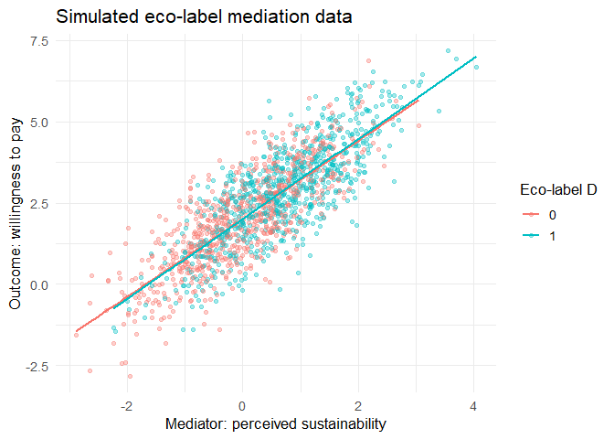
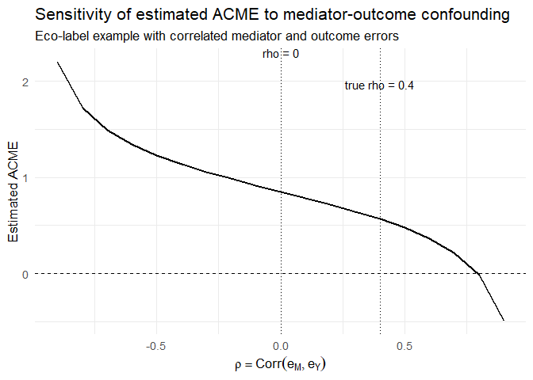

Sensitivity Analysis for Causal Mediation
================

- [Setup](#setup)
- [1. Simulate the eco-label mediation
  example](#1-simulate-the-eco-label-mediation-example)
- [2. Inspect the simulated
  confounding](#2-inspect-the-simulated-confounding)
- [3. Fit the standard mediation
  models](#3-fit-the-standard-mediation-models)
- [4. Estimate ACME using `mediate()`](#4-estimate-acme-using-mediate)
- [5. Sensitivity analysis with
  `medsens()`](#5-sensitivity-analysis-with-medsens)
- [6. Extract ACME under different values of
  rho](#6-extract-acme-under-different-values-of-rho)
- [7. Highlight rho = 0 and the true simulated
  rho](#7-highlight-rho--0-and-the-true-simulated-rho)
- [8. Plot the sensitivity curve](#8-plot-the-sensitivity-curve)
- [9. Interpretation](#9-interpretation)

## Setup

``` r
knitr::opts_chunk$set(message = FALSE, warning = FALSE)
# Install if needed:
# install.packages(c("mediation", "MASS", "dplyr", "ggplot2", "knitr"))

library(mediation)
```

    ## Warning: package 'mediation' was built under R version 4.4.3

    ## Loading required package: MASS

    ## Loading required package: Matrix

    ## Loading required package: mvtnorm

    ## Loading required package: sandwich

    ## mediation: Causal Mediation Analysis
    ## Version: 4.5.1

``` r
library(MASS)
library(dplyr)
```

    ## 
    ## Attaching package: 'dplyr'

    ## The following object is masked from 'package:MASS':
    ## 
    ##     select

    ## The following objects are masked from 'package:stats':
    ## 
    ##     filter, lag

    ## The following objects are masked from 'package:base':
    ## 
    ##     intersect, setdiff, setequal, union

``` r
library(ggplot2)
library(knitr)

set.seed(1234)
```

## 1. Simulate the eco-label mediation example

We simulate a study where:

- (D): eco-label treatment, randomized
- (M): perceived sustainability
- (Y): willingness to pay
- the mediator and outcome are confounded through correlated errors

The data-generating process is:

``` math
M_i = \alpha_0 + \alpha_1 D_i + e_{Mi}
```

``` math
Y_i = \beta_0 + \beta_1 D_i + \beta_2 M_i + e_{Yi}
```

with

$`\text{Corr}(e_{Mi}, e_{Yi}) = \rho.`$

``` r
n <- 1500

# True residual correlation between mediator and outcome equations
rho_true <- 0.40

# Treatment: randomized eco-label
D <- rbinom(n, size = 1, prob = 0.5)

# Correlated mediator/outcome errors
Sigma <- matrix(
  c(1, rho_true,
    rho_true, 1),
  nrow = 2
)

errors <- MASS::mvrnorm(n = n, mu = c(0, 0), Sigma = Sigma)

e_M <- errors[, 1]
e_Y <- errors[, 2]

# Parameters
alpha_0 <- 0.00
alpha_1 <- 0.70   # effect of eco-label on perceived sustainability

beta_0  <- 2.00
beta_1  <- 0.30   # direct effect of eco-label on willingness to pay
beta_2  <- 0.80   # effect of perceived sustainability on willingness to pay

# Mediator: perceived sustainability
M <- alpha_0 + alpha_1 * D + e_M

# Outcome: willingness to pay
Y <- beta_0 + beta_1 * D + beta_2 * M + e_Y

dat <- data.frame(
  D = D,
  M = M,
  Y = Y
)

head(dat)
```

<div class="kable-table">

|   D |          M |        Y |
|----:|-----------:|---------:|
|   0 | -0.8076136 | 1.995909 |
|   1 | -0.0248968 | 3.178497 |
|   1 |  1.9830236 | 4.625577 |
|   1 |  0.1551506 | 3.125837 |
|   1 |  0.0481521 | 1.731704 |
|   1 |  0.0377332 | 3.653288 |

</div>

## 2. Inspect the simulated confounding

Because the two errors are correlated, the mediator-outcome relationship
is confounded.

``` r
cor(e_M, e_Y)
```

    ## [1] 0.4079619

``` r
ggplot(dat, aes(x = M, y = Y, color = factor(D))) +
  geom_point(alpha = 0.35) +
  geom_smooth(method = "lm", se = FALSE) +
  labs(
    x = "Mediator: perceived sustainability",
    y = "Outcome: willingness to pay",
    color = "Eco-label D",
    title = "Simulated eco-label mediation data"
  ) +
  theme_minimal(base_size = 13)
```

<!-- -->

## 3. Fit the standard mediation models

The analyst usually does not observe the correlated errors. So we fit
the usual linear mediation models:

``` r
med_model <- lm(M ~ D, data = dat)

out_model <- lm(Y ~ D + M, data = dat)

summary(med_model)
```

    ## 
    ## Call:
    ## lm(formula = M ~ D, data = dat)
    ## 
    ## Residuals:
    ##     Min      1Q  Median      3Q     Max 
    ## -2.9318 -0.7070 -0.0036  0.6898  3.3483 
    ## 
    ## Coefficients:
    ##              Estimate Std. Error t value Pr(>|t|)    
    ## (Intercept) -0.001493   0.036191  -0.041    0.967    
    ## D            0.700379   0.050878  13.766   <2e-16 ***
    ## ---
    ## Signif. codes:  0 '***' 0.001 '**' 0.01 '*' 0.05 '.' 0.1 ' ' 1
    ## 
    ## Residual standard error: 0.9852 on 1498 degrees of freedom
    ## Multiple R-squared:  0.1123, Adjusted R-squared:  0.1117 
    ## F-statistic: 189.5 on 1 and 1498 DF,  p-value: < 2.2e-16

``` r
summary(out_model)
```

    ## 
    ## Call:
    ## lm(formula = Y ~ D + M, data = dat)
    ## 
    ## Residuals:
    ##      Min       1Q   Median       3Q      Max 
    ## -2.97036 -0.61391  0.00826  0.65475  3.05893 
    ## 
    ## Coefficients:
    ##             Estimate Std. Error t value Pr(>|t|)    
    ## (Intercept) 2.014462   0.033803  59.595   <2e-16 ***
    ## D           0.007885   0.050436   0.156    0.876    
    ## M           1.217208   0.024132  50.440   <2e-16 ***
    ## ---
    ## Signif. codes:  0 '***' 0.001 '**' 0.01 '*' 0.05 '.' 0.1 ' ' 1
    ## 
    ## Residual standard error: 0.9202 on 1497 degrees of freedom
    ## Multiple R-squared:  0.6574, Adjusted R-squared:  0.6569 
    ## F-statistic:  1436 on 2 and 1497 DF,  p-value: < 2.2e-16

## 4. Estimate ACME using `mediate()`

Under sequential ignorability, the estimated ACME is obtained using
`mediate()`.

``` r
med_fit <- mediate(
  model.m = med_model,
  model.y = out_model,
  treat = "D",
  mediator = "M",
  sims = 1000
)

summary(med_fit)
```

    ## 
    ## Causal Mediation Analysis 
    ## 
    ## Quasi-Bayesian Confidence Intervals
    ## 
    ##                 Estimate 95% CI Lower 95% CI Upper p-value    
    ## ACME            0.851759     0.726900     0.966757  <2e-16 ***
    ## ADE             0.009842    -0.092539     0.109366    0.84    
    ## Total Effect    0.861601     0.714354     1.019016  <2e-16 ***
    ## Prop. Mediated  0.987104     0.884430     1.118821  <2e-16 ***
    ## ---
    ## Signif. codes:  0 '***' 0.001 '**' 0.01 '*' 0.05 '.' 0.1 ' ' 1
    ## 
    ## Sample Size Used: 1500 
    ## 
    ## 
    ## Simulations: 1000

The estimated ACME under the maintained assumption of no residual
mediator-outcome confounding corresponds to (= 0).

``` r
acme_rho0 <- tibble(
  rho = 0,
  ACME_control = med_fit$d0,
  ACME_treated = med_fit$d1,
  ACME_average = mean(c(med_fit$d0, med_fit$d1))
)

acme_rho0
```

<div class="kable-table">

| rho | ACME_control | ACME_treated | ACME_average |
|----:|-------------:|-------------:|-------------:|
|   0 |    0.8517593 |    0.8517593 |    0.8517593 |

</div>

## 5. Sensitivity analysis with `medsens()`

Now we relax the key assumption by allowing:

``` math
\rho = \text{Corr}(e_M, e_Y)
```

where (e_M) is the residual from the mediator model and (e_Y) is the
residual from the outcome model.

``` r
sens_fit <- medsens(
  med_fit,
  rho.by = 0.10,
  effect.type = "indirect"
)

summary(sens_fit)
```

    ## 
    ## Mediation Sensitivity Analysis for Average Causal Mediation Effect
    ## 
    ## Sensitivity Region
    ## 
    ##      Rho    ACME 95% CI Lower 95% CI Upper R^2_M*R^2_Y* R^2_M~R^2_Y~
    ## [1,] 0.8 -0.0193      -0.0525       0.0139         0.64       0.1947
    ## 
    ## Rho at which ACME = 0: 0.8
    ## R^2_M*R^2_Y* at which ACME = 0: 0.64
    ## R^2_M~R^2_Y~ at which ACME = 0: 0.1947

## 6. Extract ACME under different values of rho

The `medsens()` object stores the estimated ACME across a grid of
($`\rho`$) values.

``` r
# Check available fields
names(sens_fit)
```

    ##  [1] "d0"               "d1"               "upper.d0"         "lower.d0"        
    ##  [5] "upper.d1"         "lower.d1"         "z0"               "z1"              
    ##  [9] "upper.z0"         "lower.z0"         "upper.z1"         "lower.z1"        
    ## [13] "tau"              "upper.tau"        "lower.tau"        "nu0"             
    ## [17] "nu1"              "upper.nu0"        "upper.nu1"        "lower.nu0"       
    ## [21] "lower.nu1"        "rho"              "rho.by"           "sims"            
    ## [25] "err.cr.d"         "err.cr.z"         "ind.d0"           "ind.d1"          
    ## [29] "ind.z0"           "ind.z1"           "R2star.prod"      "R2tilde.prod"    
    ## [33] "R2star.d.thresh"  "R2tilde.d.thresh" "R2star.z.thresh"  "R2tilde.z.thresh"
    ## [37] "r.square.y"       "r.square.m"       "INT"              "conf.level"      
    ## [41] "effect.type"      "type"             "robustSE"         "cluster"

``` r
# Extract ACME values across rho.
# In the mediation package, d0 and d1 are the ACME under control and treatment.
sens_table <- tibble(
  rho = sens_fit$rho,
  ACME_control = sens_fit$d0,
  ACME_treated = sens_fit$d1
) %>%
  mutate(
    ACME_average = (ACME_control + ACME_treated) / 2
  )

# Keep a readable grid and ensure rho = 0 appears
sens_table_display <- sens_table %>%
  filter(rho %in% seq(-0.9, 0.9, by = 0.1)) %>%
  mutate(across(where(is.numeric), ~ round(.x, 3)))

kable(
  sens_table_display,
  caption = "Estimated ACME under different values of rho"
)
```

|  rho | ACME_control | ACME_treated | ACME_average |
|-----:|-------------:|-------------:|-------------:|
| -0.9 |        2.202 |        2.202 |        2.202 |
| -0.8 |        1.724 |        1.724 |        1.724 |
| -0.7 |        1.493 |        1.493 |        1.493 |
| -0.6 |        1.343 |        1.343 |        1.343 |
| -0.5 |        1.230 |        1.230 |        1.230 |
| -0.4 |        1.138 |        1.138 |        1.138 |
| -0.3 |        1.058 |        1.058 |        1.058 |
| -0.2 |        0.986 |        0.986 |        0.986 |
| -0.1 |        0.918 |        0.918 |        0.918 |
|  0.0 |        0.853 |        0.853 |        0.853 |
|  0.1 |        0.787 |        0.787 |        0.787 |
|  0.2 |        0.719 |        0.719 |        0.719 |
|  0.3 |        0.647 |        0.647 |        0.647 |
|  0.4 |        0.567 |        0.567 |        0.567 |
|  0.5 |        0.475 |        0.475 |        0.475 |
|  0.6 |        0.362 |        0.362 |        0.362 |
|  0.7 |        0.212 |        0.212 |        0.212 |
|  0.8 |       -0.019 |       -0.019 |       -0.019 |
|  0.9 |       -0.497 |       -0.497 |       -0.497 |

Estimated ACME under different values of rho

## 7. Highlight rho = 0 and the true simulated rho

``` r
sens_table %>%
  filter(abs(rho - 0) < 1e-8 | abs(rho - rho_true) < 1e-8) %>%
  mutate(across(where(is.numeric), ~ round(.x, 3))) %>%
  kable(
    caption = "ACME at rho = 0 and at the true simulated residual correlation"
  )
```

| rho | ACME_control | ACME_treated | ACME_average |
|----:|-------------:|-------------:|-------------:|
| 0.0 |        0.853 |        0.853 |        0.853 |
| 0.4 |        0.567 |        0.567 |        0.567 |

ACME at rho = 0 and at the true simulated residual correlation

## 8. Plot the sensitivity curve

``` r
ggplot(sens_table, aes(x = rho, y = ACME_average)) +
  geom_line(linewidth = 1) +
  geom_hline(yintercept = 0, linetype = "dashed") +
  geom_vline(xintercept = 0, linetype = "dotted") +
  geom_vline(xintercept = rho_true, linetype = "dotted") +
  annotate(
    "text",
    x = 0,
    y = max(sens_table$ACME_average, na.rm = TRUE),
    label = "rho = 0",
    vjust = -0.5,
    size = 4
  ) +
  annotate(
    "text",
    x = rho_true,
    y = max(sens_table$ACME_average, na.rm = TRUE) * 0.85,
    label = paste0("true rho = ", rho_true),
    vjust = -0.5,
    size = 4
  ) +
  labs(
    x = expression(rho == Corr(e[M], e[Y])),
    y = "Estimated ACME",
    title = "Sensitivity of estimated ACME to mediator-outcome confounding",
    subtitle = "Eco-label example with correlated mediator and outcome errors"
  ) +
  theme_minimal(base_size = 13)
```

<!-- -->

## 9. Interpretation

The usual mediation estimate assumes:

``` math
\rho = 0.
```

But in this simulation, the data were generated with:

``` math
\rho = 0.40.
```

If the estimated ACME changes substantially as ($`\rho`$) moves away
from zero, then the mediation conclusion is sensitive to unobserved
mediator-outcome confounding.

The key reporting question is:

> How large would ($`\rho`$) need to be to make the ACME close to zero,
> and is that amount of confounding plausible in this research setting?
