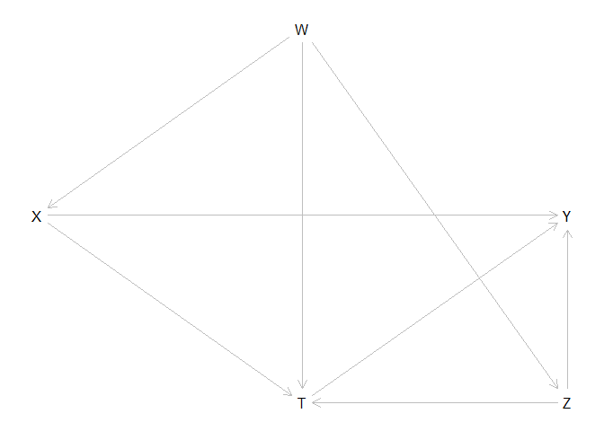

Tutorial-1
================
Xi Chen
2023-06-07

### **Description**

This is a short tutorial of DAGitty. We will focus on the basics of
drawing DAGs and performing graphical analyses on DAGs. DAGitty covers
more useful functioning than what is introduced here. For more details,
please visit <http://www.dagitty.net>.

``` r
# please download and load dagitty to the workspace. 
require(dagitty)
```

    ## Loading required package: dagitty

    ## Warning: package 'dagitty' was built under R version 4.2.3

### The Basics

You may draw a DAG with a simple symbolic language used by DAGitty. To
draw a DAG, you may use statement like: ‘dag{…}’, and within the curly
brackets, you need to specify nodes (variables) and links. For nodes,
use a statement like ‘X\[…\]’, and within the brackets, you specify
properties such as positions (‘pos = …’). For links, you specify the
links between nodes, such as ‘X -\> Y’. Note that you may also specify
the paths to make things easier.

``` r
# Note that you may also use different paths statements for the same DAG, as long as all links are included. 
g <- dagitty('dag {
    X [pos="0,1"]
    T [pos="1,2"]
    Z [pos="2,2"]
    W [pos="1,0"]
    Y [pos="2,1"]
    
    X -> T <- Z -> Y
    X <- W -> T -> Y
    W -> Z
    X-> Y
}')
plot(g)
```

<!-- --> Given the
DAG, you may request a bunch of things, such as parents, children,
ancestors and descendants of nodes.

``` r
#By convention, descendants(g,v) and ancestors(g,v) include v but children(g,v) and parents(g,v) do not.
parents(g,"Z") # parents of Z
```

    ## [1] "W"

``` r
ancestors(g,"Z") # ancestors of Z
```

    ## [1] "Z" "W"

``` r
children(g,"W") #children of W
```

    ## [1] "T" "X" "Z"

``` r
descendants(g,"W") #descendants of W
```

    ## [1] "W" "Z" "Y" "X" "T"

### Path Analysis

Furthermore, you can analyze the paths between any pair of nodes using
*paths()*. The function returns a list with the first element showing
all paths and the second whether paths are open (i.e., d-separated).

``` r
#all paths between X and Y 
paths(g,"X","Y") 
```

    ## $paths
    ## [1] "X -> T -> Y"           "X -> T <- W -> Z -> Y" "X -> T <- Z -> Y"     
    ## [4] "X -> Y"                "X <- W -> T -> Y"      "X <- W -> T <- Z -> Y"
    ## [7] "X <- W -> Z -> T -> Y" "X <- W -> Z -> Y"     
    ## 
    ## $open
    ## [1]  TRUE FALSE FALSE  TRUE  TRUE FALSE  TRUE  TRUE

You can also test if conditioning on some variables d-separates a pair
of nodes by using *dseparated*.

``` r
nodes <- c("W","Y")
if(dseparated(g,"X","Z",nodes)){
  message("X"," and ", "Y"," are independent.")
} else {
  message("X"," and ", "Y", " are not independent.")
}
```

    ## X and Y are not independent.

As a matter of fact, you may also get all implied independencies in the
graph with the function below:

``` r
impliedConditionalIndependencies(g)
```

    ## W _||_ Y | T, X, Z
    ## X _||_ Z | W

### Adjustment Sets

Given a DAG, the package also gives suggestions of the set of variables
for adjustments for the identification of a causal effect. This function
makes use of the do-calculus.

``` r
#To get all sets of variables for backdoor adjustments
print("All adjustment sets")
```

    ## [1] "All adjustment sets"

``` r
adjustmentSets(g,"X","Y",type = "all")
```

    ## { W }
    ## { W, Z }

``` r
#The minimal set if "type" is not specified
print("The minimal adjustment set")
```

    ## [1] "The minimal adjustment set"

``` r
adjustmentSets(g,"X","Y")
```

    ## { W }

You may also test if including a node in the adjustment set is valid.

``` r
#set the cause and outcome variable
exposures(g) <- "X"
outcomes(g) <- "Y"

#checking if including T is Okay
isAdjustmentSet(g,"T")
```

    ## [1] FALSE
